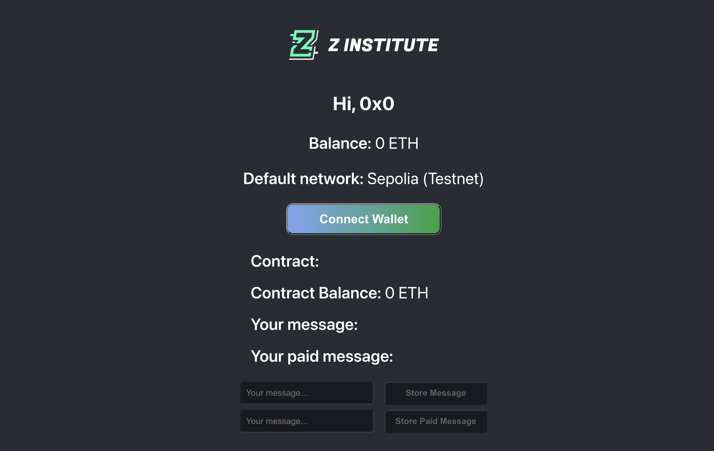
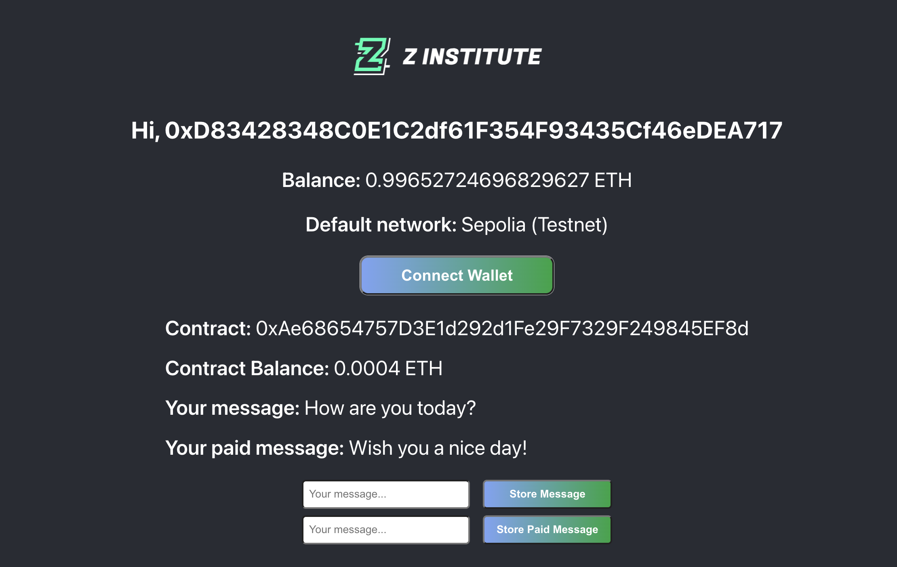
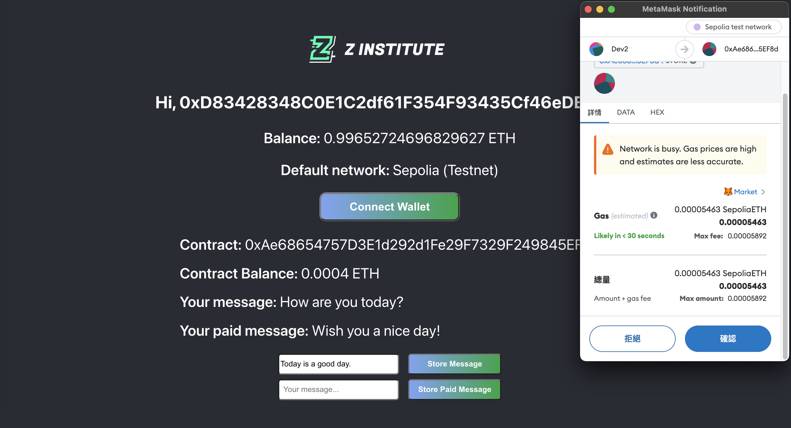
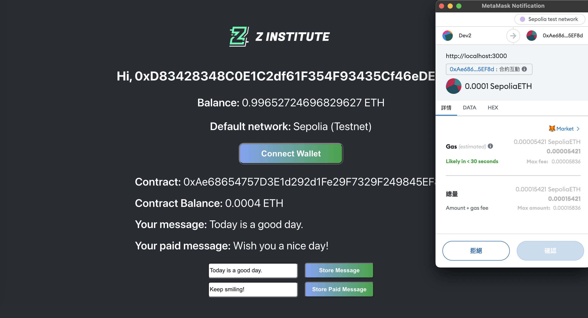
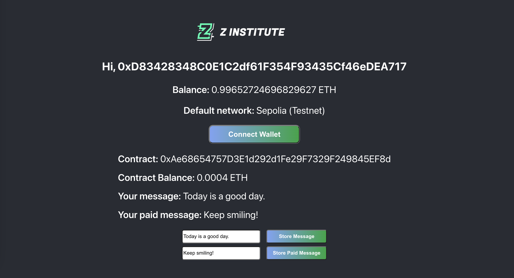

# A Simple DApp

This is my first decentralised app based React framework development. This app could connect to your wallet and show user's address and balance on the screen. In addition, there is a default smart contract with storing messages functions allowing users to interact with the contract by signing the transactions and paying gas fees.

 

**_This DApp is only available for Sepolia (Testnet)!_**

 

The following steps are the introduction of the DApp:

### 1. Follow the links for more details! ([Demo link]) ([GitHub Link])

### 2. Click 'Connect Wallet' to obtain user's wallet information and the details of default smart contract such as contract balance and functions.

### 3. Type in message and click 'Store Message' to update message onto the smart contract. At this moment, user needs to sign the transaction and pay the gas fee.

### 4. After a few seconds waiting, DApp obtains the message from the contract and displays it on the screen.

### 5. It is the same action to 'Store Paid Message'. However, apart from the regular gas fees, this transaction needs user to transfer 0.0001 ETH to the smart contract to trigger the transaction.

### 6. After a few seconds waiting, DApp obtains the paid message from the contract and displays it on the screen.

[Demo link]: https://web3-simple-dapp.vercel.app/ "DApp Demo"
[GitHub Link]: https://github.com/RamonLiao/Web3/tree/master/00_simple-web3-app "GitHub"
