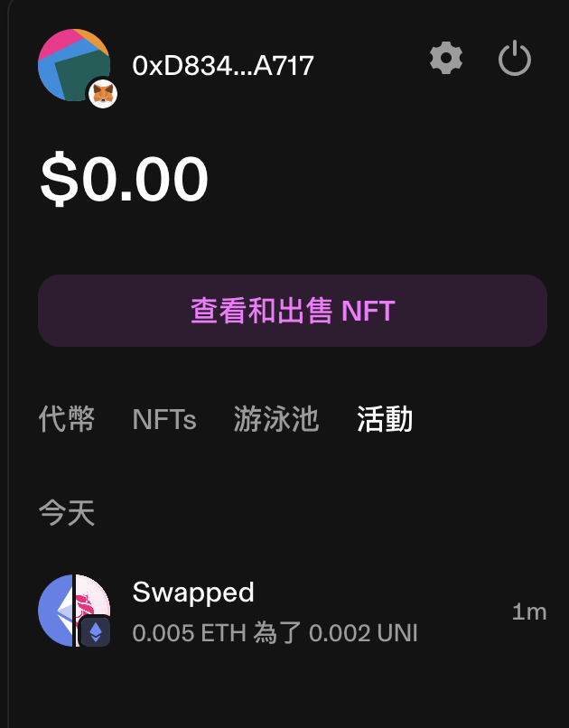

# Week 1 Homework - The Introduction of Web 3.0 for Front-End Engineers

## Chapter 1: From Web 2.0 to Web 3.0

### 1. Please give an example which it is suitable to be re-developed and moved to Web 3, and describe why?

In the UK, university students widely have discounts on different services, such as buying groceries or train tickets. There are several companies provide apps to let student to use promotion codes via their applications. However, such a one student, student status varies on different apps beacause of different verificaton dates. Graduated students can keep using these promotion apps even their student status has already expired for a year.

Therefore, I think the verification process can be re-designed and moved to Web 3, such as KYC process. It allows the blockchain to keep student status, and each promotion app can obtain student info from the blockchain and check the validity of each student status.

### 2. Choose an application introduced in the lecture, provide the screenshots of usage, and share the feedback.

Recently, I do some research on DeFi and flashloan. There are a few interesting website such as [FURUCOMBO] and [EigenPhi]. FURUCOMBO allows users to build their own DeFi and execute it. EigenPhi visualises the workflows of sandwitch attack, liquidation, and flashloan.

### 3. List development languages, frameworks, front-end tools that you have widely used. Is there any practice of DApp?

<table>
<tr><th>Name</th><th>Note</th></tr>
<tr><td>ReactJS</td><td></td></tr>
<tr><td>NextJS</td><td></td></tr>
<tr><td>Vercel</td><td>Cloud Server</td></tr>
<tr><td>Fundamental Solidity</td><td></td></tr>
<tr><td>ExpressJS</td><td>Back End</td></tr>
<tr><td>MongoDB</td><td>Cloud Database</td></tr>
<tr><td>JavaScript</td><td></td></tr>
<tr><td>APIs</td><td></td></tr>
<tr><td>Python</td><td></td></tr>
</table>

### 4. Give the feedback of this chapter.

 

## Chapter 2: The fundamentals of DApp development

### 1. Use MetaMask and connect to the testnet 'Sepolia' and provide a screenshot of completing a token transaction via Uniswap.

### 2. Share the Etherscan link of your transaction and shortly describe transaction time and gas fees.

Transaction Hash: 0x0f9093c3ba2b172075077345820188d9a53548faf8f5b639f566a85ca668b11e
([Transaction Link])

The transaction took less than 10 secs to complete. The notification also alerted quiickly.
In the mean time, the gas fees were lower on the testnet Sepolia than the main net. The transaction spent around 2.16 Gwei for gas fees lower than 22 Gwei on the main net.

### 3. List the differences among Ethers.js, Web3Modal, Web3.js, WAGMI, or other libraries.

I haven't used all of these libraries yet and can't make a conclusion easily based on the articles by others.

<table>
<tr><th>Features</th><th>Ethers.js</th><th>Web3Modal</th><th>Web3.js</th><th>WAGMI</th><th>Other</th></tr>
<tr><td>Document</td><td>More detailed</td><td></td><td></td><td></td><td></td></tr>
<tr><td>Libraries</td><td>More tested</td><td></td><td></td><td></td><td></td></tr>
<tr><td>Size</td><td>Lighter</td><td></td><td>Heavier</td><td></td><td></td></tr>
<tr><td>Wallet Support</td><td></td><td>Highest</td><td></td><td></td><td></td></tr>
<tr><td>Supported Frameworks</td><td></td><td>Vanilla JS</td><td>React, Vanilla JS</td><td></td><td></td></tr>
</table>

### 4. Give the feedback of this chapter.

 

## Chapter 3: Advance DApp development

### 1. Deploy your DApp onto Netlify or any web server, and you may customise the app and provide the link.

This DApp is deployed on Vercel server. ([Demo link]) ([GitHub Link])

### 2. Please do not forget to develop an app with respnosive UI, and demostrate it to your friends on MetaMask app.

Refer to previous note.

### 3. Bonus questions: Add other functions or APIs, such as bulletin boards, pinning the message on the top, a live-stream music app, display contract balance.

Refer to previous note.

### 4. Give the feedback of this chapter.

 

## Chapter 4: Wrapping up and next step...

### 1. Please share blockchain press or learning channels you are following.

<table>
<tr><th>Name</th><th>Note</th></tr>
<tr><td>Alchemy University</td><td><a href="https://www.alchemy.com/university">link</a> </td></tr>
<tr><td>Chainlink</td><td><a href="https://chain.link/bootcamp">link</a> </td></tr>
<tr><td>WTF Academy</td><td><a href="https://www.wtf.academy/">link</a> </td></tr>
<tr><td>巴比特</td><td><a href="https://www.8btc.com/">link</a> </td></tr>
<tr><td>動區 Block Tempo</td><td><a href="https://www.blocktempo.com/">link</a> </td></tr>
<tr><td>鏈新聞</td><td><a href="https://abmedia.io/">link</a> </td></tr>
<tr><td>區塊客</td><td><a href="https://blockcast.it/">link</a> </td></tr>
</table>

### 2. Give the final feedback for this course.

### 3. How long did you take to complete this course?

1 hour to finish the letures and more than 10 hours to realise the DApp.

### 4. Share your learning notes.

### 5. What else would you like us to introduce?

[Transaction Link]: https://sepolia.etherscan.io/tx/0x0f9093c3ba2b172075077345820188d9a53548faf8f5b639f566a85ca668b11e "Etherscan"
[FURUCOMBO]: https://furucombo.app/ "Custimise your DeFi contracts based on specific strategies"
[EigenPhi]: https://eigenphi.io/mev/ethereum/flashloan "Visualised the workflows of arbitrage with flash loan"
[Demo link]: https://web3-simple-dapp.vercel.app/ "DApp Demo"
[GitHub Link]: https://github.com/RamonLiao/Web3/tree/master/00_simple-web3-app "GitHub"
