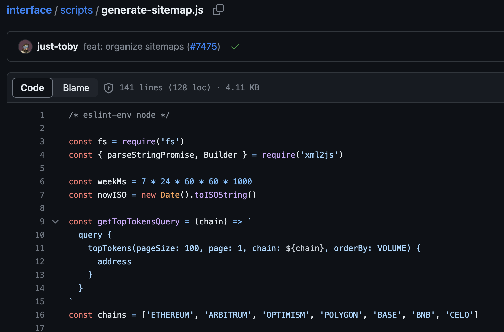
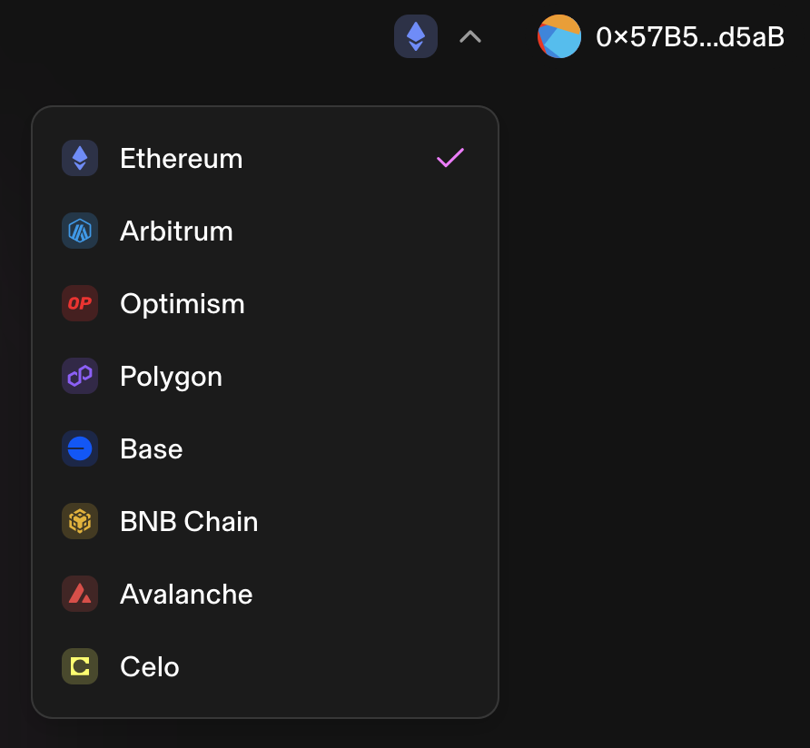
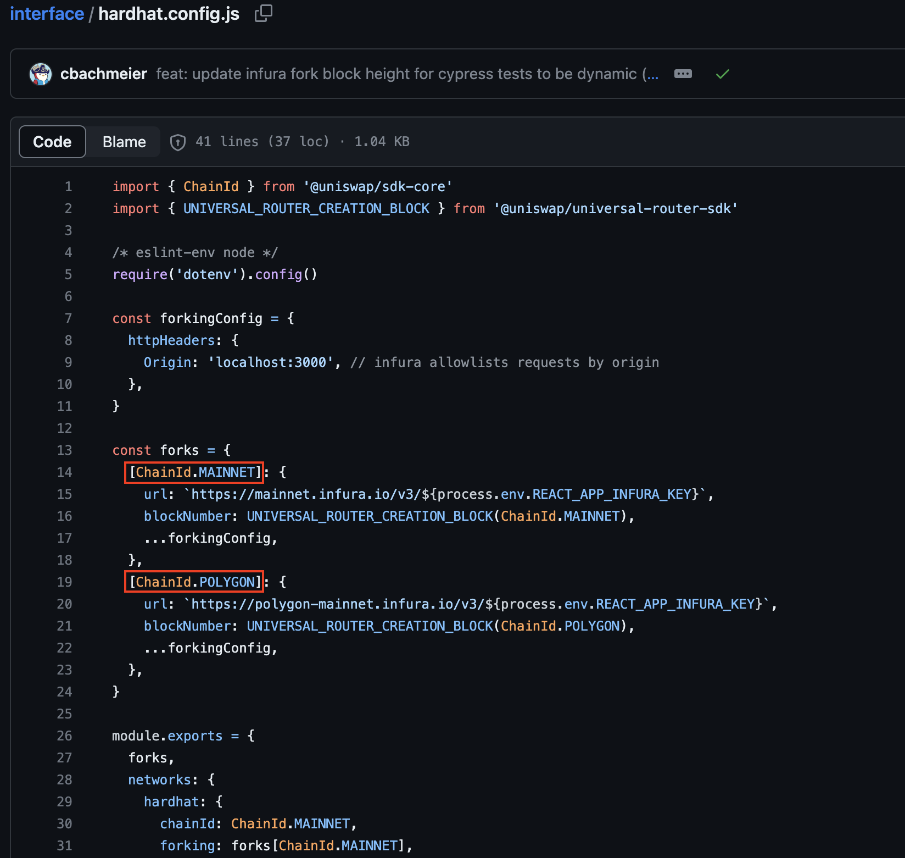
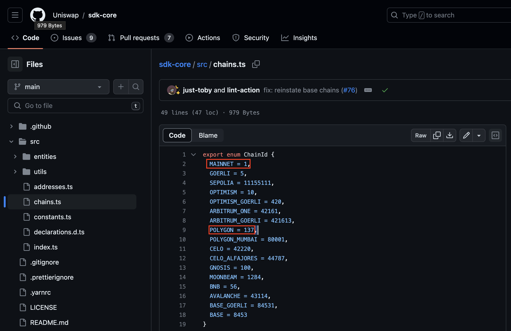
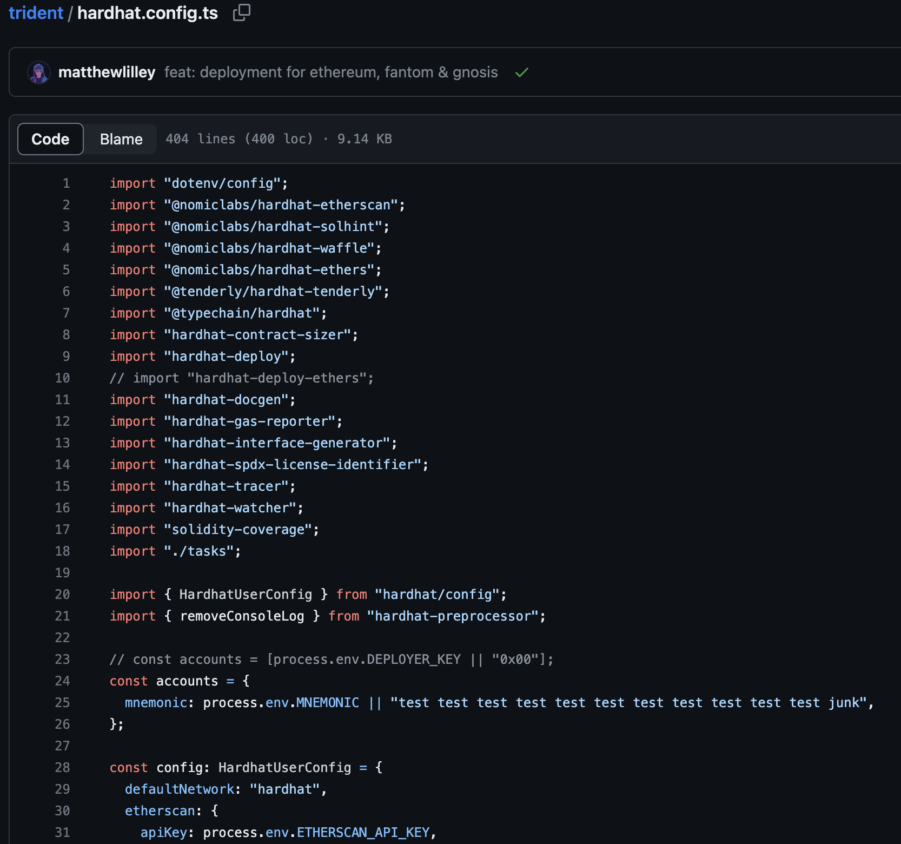
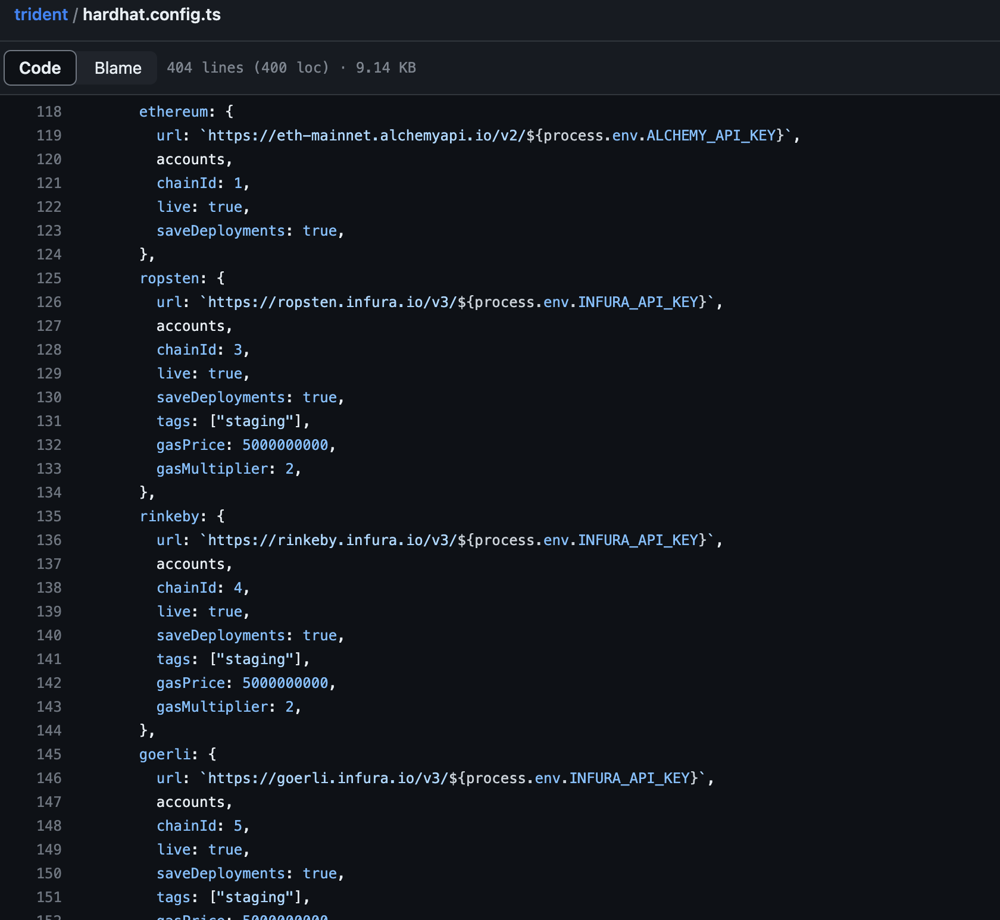
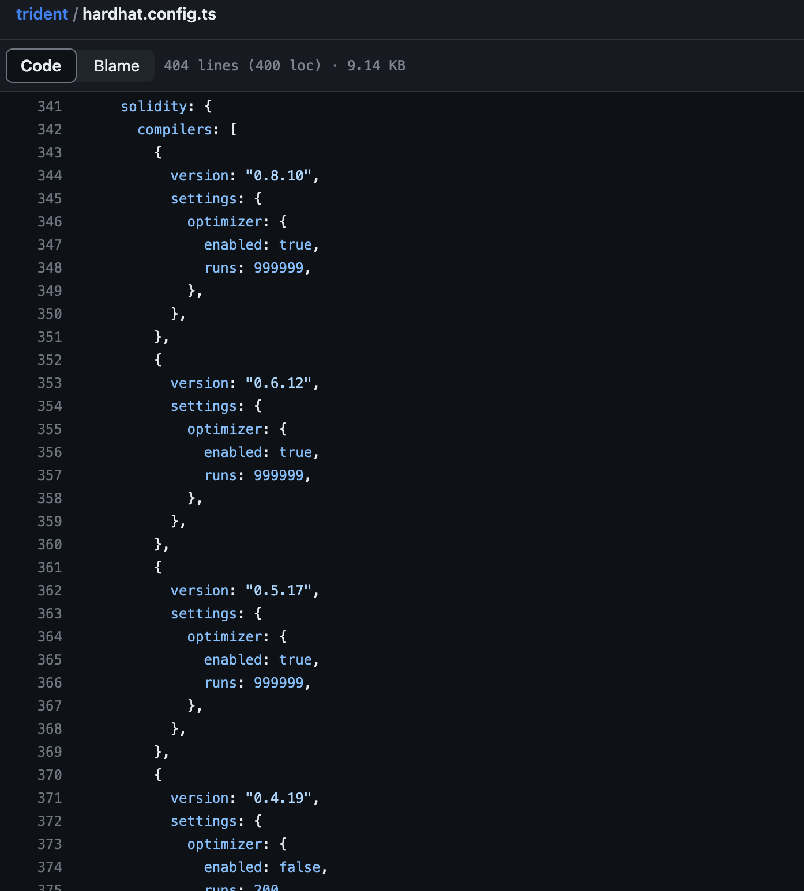
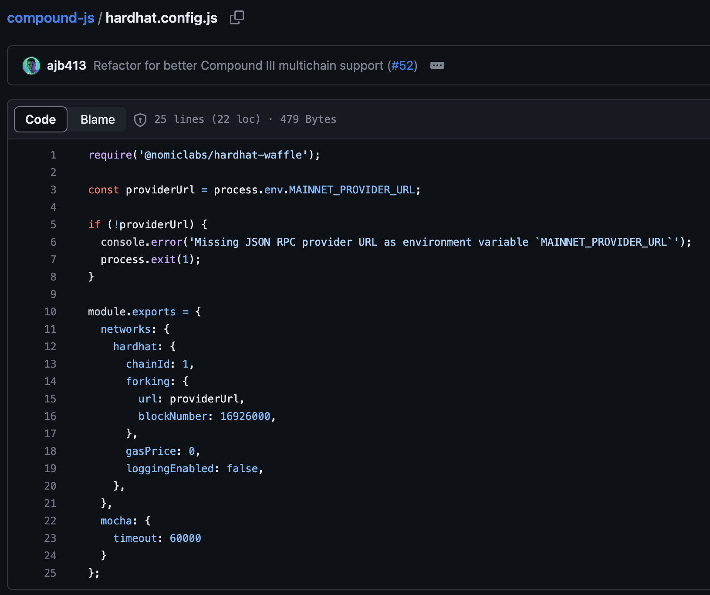

# Analysis of Web 3 Projects Based on Hardhat Frameworks

## Uniswap

Uniswap is a web app to provide token-swap functions and earning profits by staking tokens in the pools which enhances the liquidity. It is built on Ethereum-based blockchains.

### Uniswap Analysis ([GitHub](https://github.com/Uniswap/interface))

1. According to Uniswap's interfacing script on GitHub, there are 7 chains available to be utilise.
   

   In fact, it is available to operate transactions on 8 different chains!
   

2. According to its Hardhat Configuration, there are two available chains, such as Ethereum (net ID 1) and Polygon (net ID 137), to be forked and to test their contracts and business logic.

   
   

 

## Sushiswap

Compared to Uniswap, Sushiswap provides similar functions. It is also built on Ethereum-based blockchains and serves as a multi-chain solution, catering to BSC and Fantom.

### Sushiswap Analysis ([GitHub](https://github.com/sushiswap/trident))

1. Compared to Uniswap, Sushiswap is a newer dapp. It uses more Hardhat functions to track the data on the blockchain and test their contracts and dapps.

   

   Because Sushiswap serves as a multi-chain solutions, it sets up several blockchains in configuration script for test, such as Ethereum, Ropsten, Rinkeby, Goerli, Kovan, Fantom, Polygon, Matic-testnet, Gnosis, BSC, Heco, Avalanche, Arbitrum, Celo, Optimism, Kava, and so on.
   

2. Sushiswap also sets up multiple versions of Solidity compilers
   

 

## Compound.js

Compound.js is a JavaScript SDK for Ethereum and Compound protocal, which is an EVM compatible protocol. It wraps functions from Ethers.js and is designed for both web browser and Node.js.

### Compound Analysis ([GitHub](https://github.com/compound-finance/compound-js))

1. Compound JS
   
    

## Other Front-End Apps
