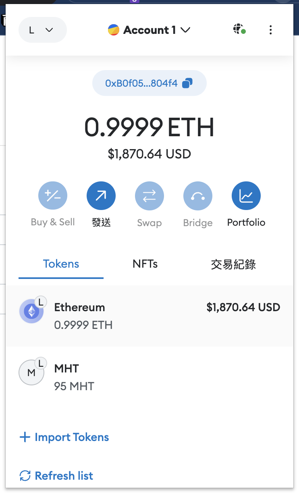
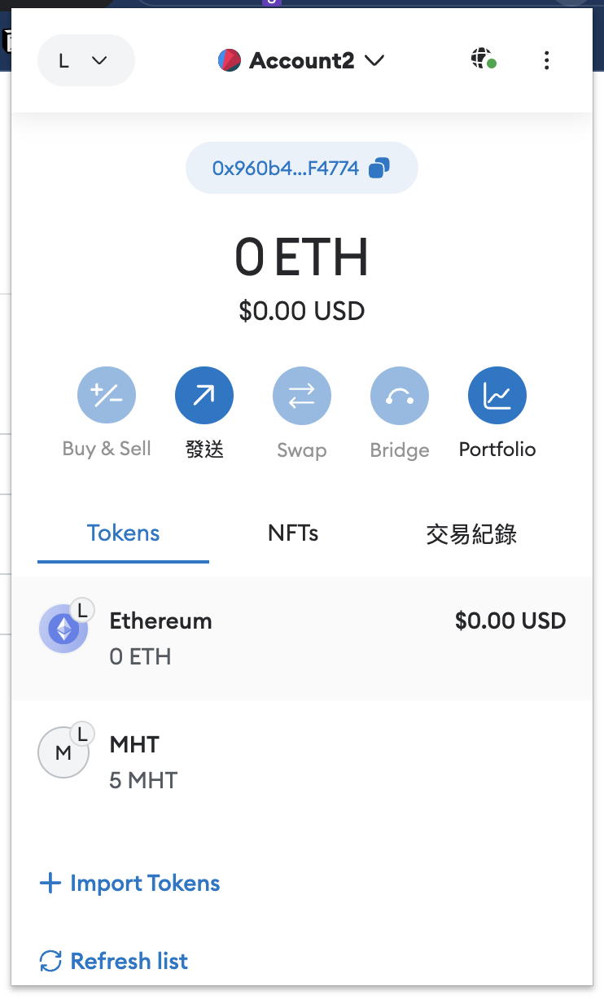
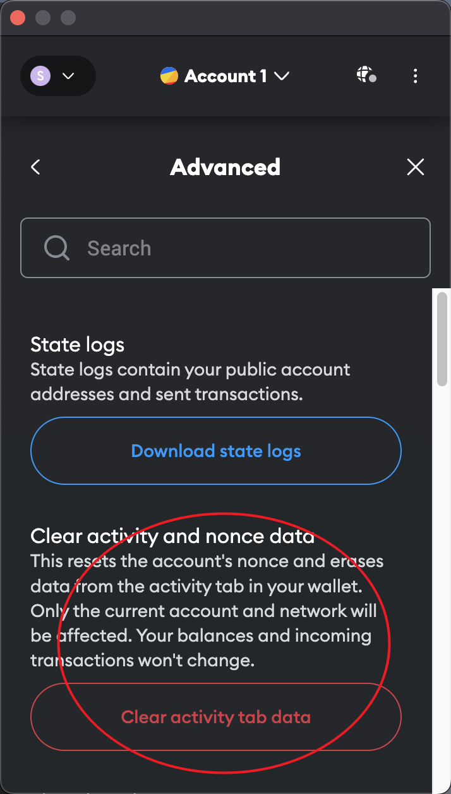
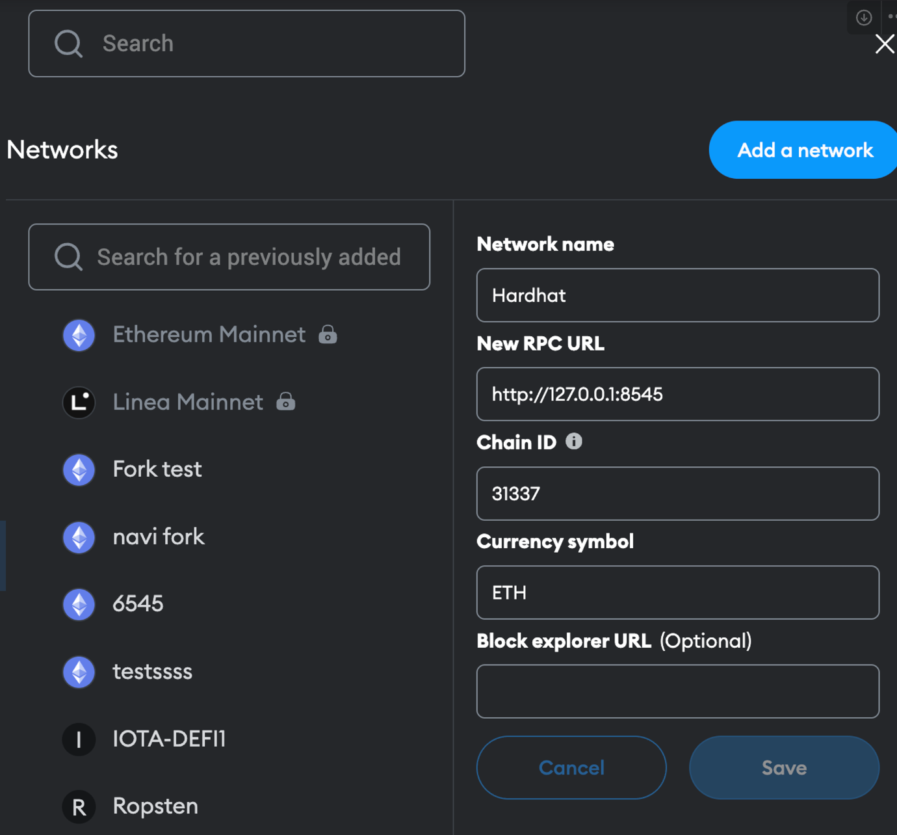
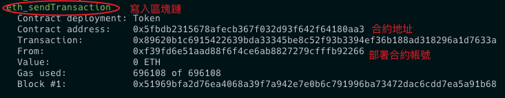
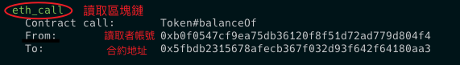
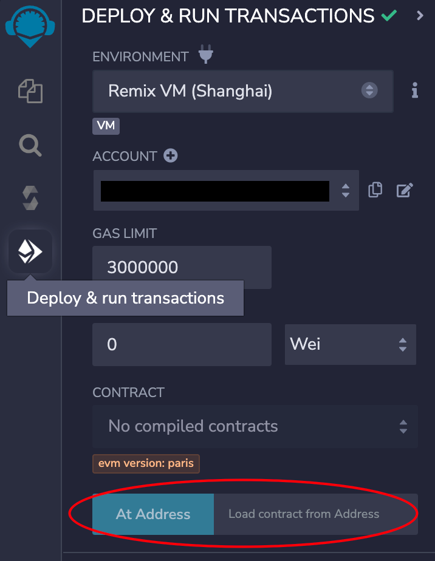

# Hardhat 框架

- [hardhat offical tutorial](https://hardhat.org/tutorial)
- [hardhat simple example](https://github.com/z-institute/Hardhat-Example)
- [hardhat boilerplate](https://github.com/NomicFoundation/hardhat-boilerplate)

## 🖼 Hardhat Boilerplate 

### 專案結構

- artifacts 為編譯後的合約
- contract 放置合約邏輯
- frontend 用來 UI 顯示畫面
- scripts 用來部署合約
- tasks 用來 faucet token
- test  用來測試合約

### 合約規則和 screenshot

- 該合約部署時會有 1000000 固定 MHT token，給部署者
- 該合約只有兩個功能
  1. 轉 token 給其他帳號
  2. 查詢帳號 token 的功能 
- 以下圖是 account 1 轉了 5MHT token 給 account2

| | | |
|:-------------------------:|:-------------------------:|:-------------------------:|
||||
  

## :pen: 筆記

- hardhat 框架中部分資料夾命名固定


### 智能合約

- 撰寫智能合約在 contracts 資料夾底下 ( ex : Token.sol )
  - `npx hardhat compile` 編譯智能合約，會在 artifacts 放置合約編譯完檔案

### 測試流程

#### 1. 測試網

- 撰寫智能合約的 Unit test 在 test 資料夾底下，並以 `npx hardhat test` 執行測試，這邊的測試是以 hardhat 測試框架提供的
- 如預在指定的測試網做測試，可在 [hardhat.config.js](https://hardhat.org/tutorial/deploying-to-a-live-network#deploying-to-remote-networks) 檔案添加其 network 資訊，並執行 `npx hardhat test --network <network-name>`，來實際和該測試網互動
  - **補充1** : 範例的 INFURA_API_KEY 是來自於 [infura](https://app.infura.io/dashboard) 提供用來跟區塊鏈網路溝通用的 api ( infura api key 即 hardhat.config.js networks 下的 url )
  - **補充2** : 也可以使用 [alchemy](https://www.alchemy.com/) api key 
  - **補充3** : [infura](https://app.infura.io/dashboard) 和 [alchemy](https://www.alchemy.com/) 中
    - 使用 `<API EndPoint>/<APIKey>` 去來跟 web3 API 或 [IPFS](https://cointelegraph.com/learn/what-is-the-interplanetary-file-system-ipfs-how-does-it-work) 做溝通，免費版本的會有請求的上限
    - 同一個區塊鏈 API endPoint 會一樣，不同帳號 APIKey 會不同
    - wev3 API 指的個是跟區塊鏈做互動，例如：取得帳號餘額、交易 ..... 資訊
    - IFPS 可以視為分散式存取資料的地方，例如：上傳 NFT 圖片資訊 
  - **注意** : 範例中 INFURA_API_KEY 和 SEPOLIA_PRIVATE_KEY 在真實專案中不要寫死在程式中，避免上傳到 github 時公開，導致錢包裡的前輩機器人轉走，可參考 [官網存取變數方式](https://hardhat.org/hardhat-runner/docs/guides/configuration-variables#configuration-variables)

- 在本地起一個小區塊鏈測試
  - `npx hardhat node` : 在本地起一個小區塊鏈測試
    - 配置 `hardhat.config.js` ( PRIVATE_KEY 記得是從 `npx hardhat node` 啟動時，給的 20 個帳號中，選一個 private key )

		```js
		module.exports = {
		  // Your Hardhat configuration here...
		
		  networks: {
			local:{
			url: "http://localhost:8545",
			accounts: [PRIVATE_KEY]
			},
			// ...
		  },
		  // ...
		};
		```
  - `npx hardhat node` 重啟時記得，要 clear activity and nonce data，否則會出現以下 [錯誤](https://ethereum.stackexchange.com/questions/109625/received-invalid-block-tag-87-latest-block-number-is-0)

    <div align="center" style="width:360px">
      
    </div>

	- 搭配 `npx hardhat test --network local` 將合約部署在本地的小區塊鏈上，並測試
  - metamask 連本地區塊鏈 network 配置
    <div align="center" style="width:360px">
      
    </div>

#### 2. 主網分岔

- 主網的平行宇宙，分岔出來的測試，不會影響到主網
- `npx hardhat node --fork <想要連的網路> --fork-block-number <block-number>`

#### 3. 主網

## 區塊鏈中合約出發訊息


[hardhat 中使用 log](https://hardhat.org/tutorial/debugging-with-hardhat-network#solidity--console.log)



## :pen: 程式方面筆記

### 測試

- 部署合約
  ```js
  // 第二個參數如果該合約有需要再填
  const contract = await ethers.deployContract("<contract-name>", ["<contract-arg>",...]);
  ```

- attach 是拿已經部署的 contract 就是 remix IDE 中， At Address 部分
  ```js
  const contractFactroy = await ethers.getContractFactory("<contract-name>");
  const contract = HiContractArtifact.attach(
    "<the deployed contract address>"
  );
  ```

    <div align="center" style="width:360px">
      
    </div>

- 使用 loadFixture(deployContractAsyncFunc) 來避免測試時多次部署合約，[範例](https://hardhat.org/hardhat-runner/docs/guides/test-contracts#using-fixtures)

- 參考：https://hardhat.org/hardhat-runner/docs/guides/test-contracts

### solidity

- msg.sender 特別變數，代表 Ethereum address
- external vs public vs internal vs private modifier ( 修飾詞 )
  - external : 只能從合約之外調用
  - public : 可以從合約外部調用，也可以在合約內部調用
  - internal : 在合約的函數或衍生性合約的函數內使用
  - private : 只能從定義它的當前同一合約中調用
- event : Ethereum 用於記錄有關交易和與智能合約互動的重要訊息
  - 以 `emit <event-func>` 來發送事件


