# Hardhat Boilerplate Exercise

This exercise follows the [Hardhat tutorial] and creates a project based on React framework.

Under the main architecture of this boilerplate project, it has:

1. Frontend folder to develop user interface and interact with user's wallet
2. Contracts folder to define the smart contract in Solidity and test folder to test each function of Solidity contract
3. Scripts folder to deploy the contract to Hardhat network
4. Tasks folder to transfer initial MHT and ETH tokens to user's test account

<br>

The following steps will demonstrate how to execute the dapp and interact with Hardhat network:

1. Open a terminal (`terminal A`), clone the repository to the local workplace, and run the hardhat node for deployment preparation

   ```console
   cd hardhat-boilerplate
   npm install
   npx hardhat node
   ```

2. After Hardhat network is prepared, deploy a smart contract in a different terminal (`terminal B`). This will create 20 initial accounts with addresses and keys and display the information of genesis block.

   ```console
   npx hardhat --network localhost run scripts/deploy.js
   ```

   The first address `Oxf39Fd6e51aad88F6F4ce6aB8827279cffFb92266` owns the deployed smart contract.
   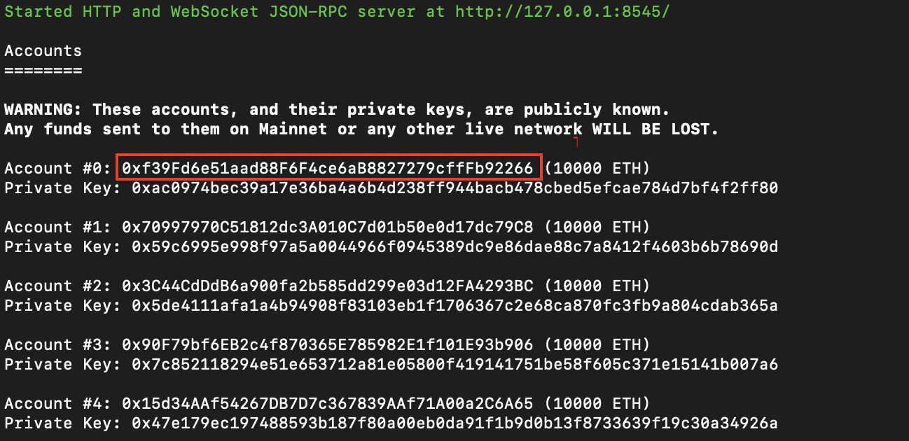

   The contract address is `0x5fbdb2315678afecb367f032d93f642f64180aa3`.
   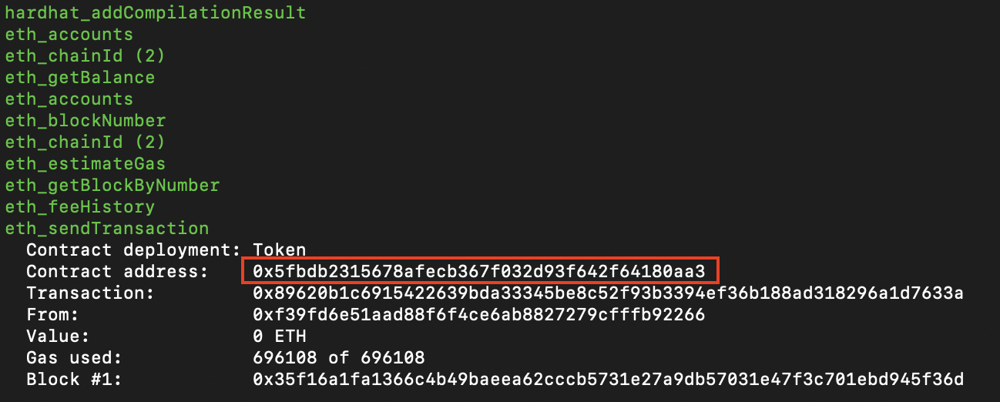

3. Start the react web app in a new terminal (`terminal C`).

   ```console
   cd frontend
   npm install
   npm run start
   ```

   

4. Set up configurations in MeataMask.

   Because I am using MetaMask, I need to select the `Localhost 8545` network and set up the chain ID with `31337` in MetaMask wallet to let it be available to read the information on the Hardhat network.
   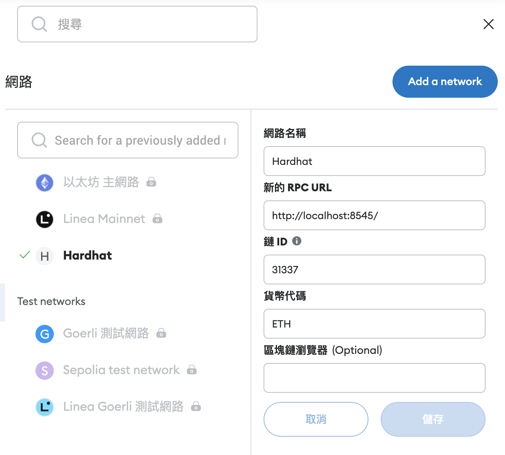

   In addition, I also need to manually import token to MetaMask wallet by configuring the contract address and token symbol.
   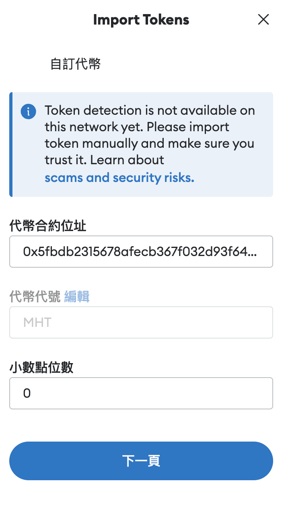

5. Once the basic configurations are set up, my own wallet doesn't have any token yet, which means the balance is `0`. By running this code with my address in `terminal B`, I could receive the token transferred from the initial account `Oxf39Fd6e51aad88F6F4ce6aB8827279cffFb92266`.

   ```console
   npx hardhat --network localhost faucet <your address>
   ```

   This code will execute the script `faucet.js` in the `tasks` folder.
   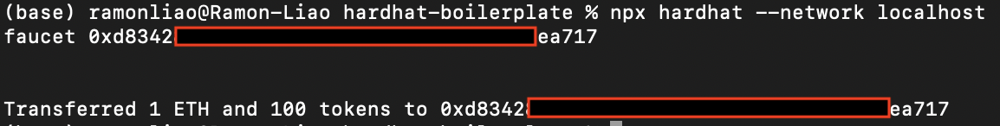

   In `terminal A`, the Hardhat network displays the transaction details about this transfer. My wallet `0xd8342...` receives 1 ETH (1 ETH is used to pay for gas fees) and 100 tokens.
   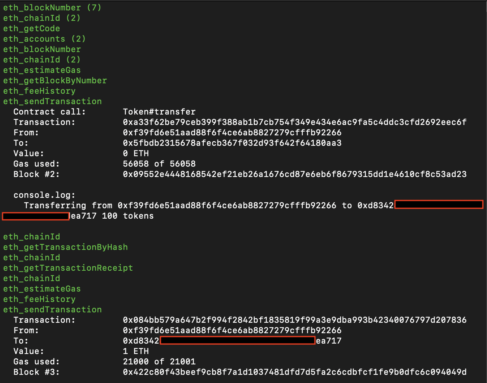

6. Let use the react web app to transfer tokens. When click the transfer button, the react web app will trigger MetaMask to let user sign the transaction.

   I transfer 5 tokens from `0xd8342...` to another personal wallet `0x70eda...`.
   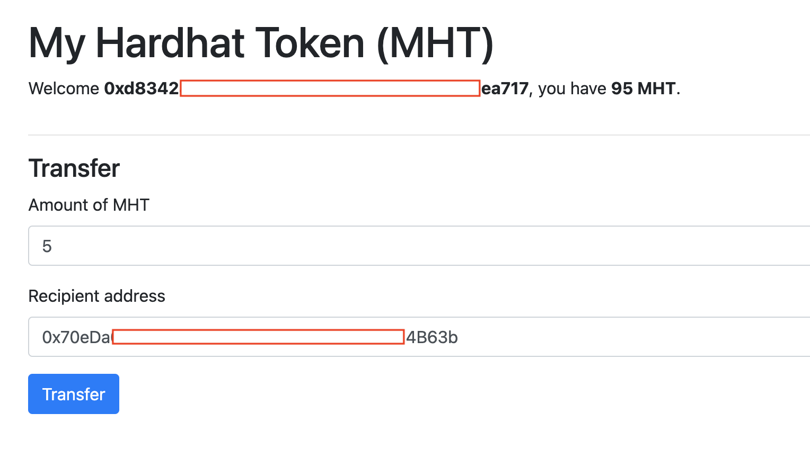
   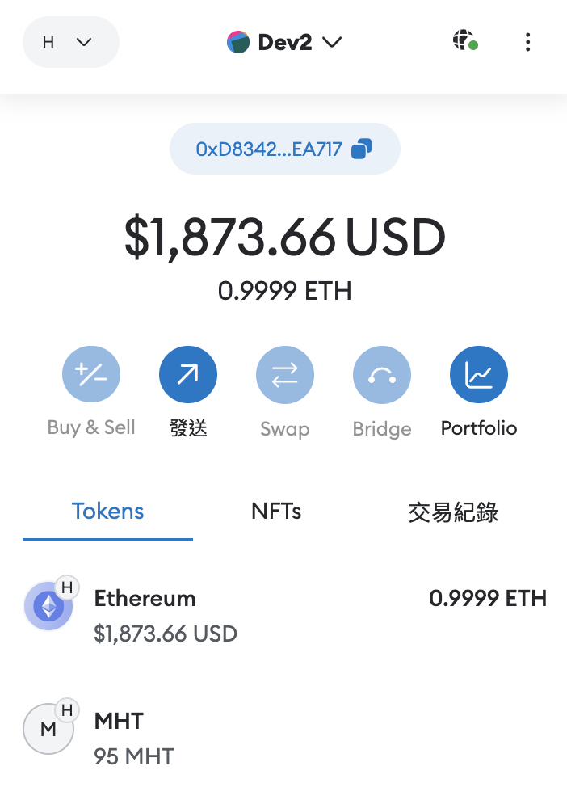

7. Investigate the process on Hardhat network in `terminal A`, it shows the transaction details.
   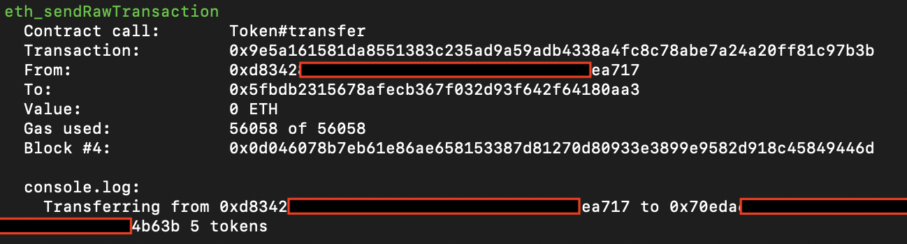

   Let look into the personal wallet `0x70eda...` on MetaMask, it receives 5 tokens.
   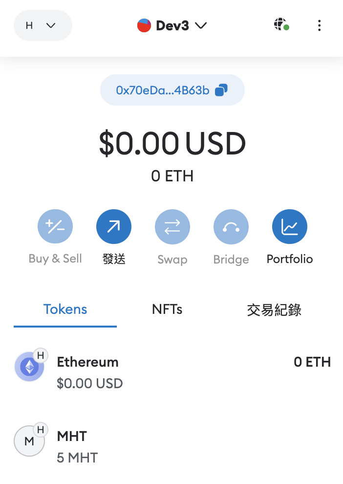

   Using the react web app, it shows the balance of receiving wallet.
   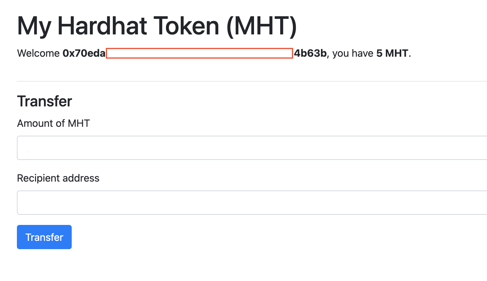

[Hardhat tutorial]: https://hardhat.org/tutorial/boilerplate-project "Hardhat Boilerplate Project"
