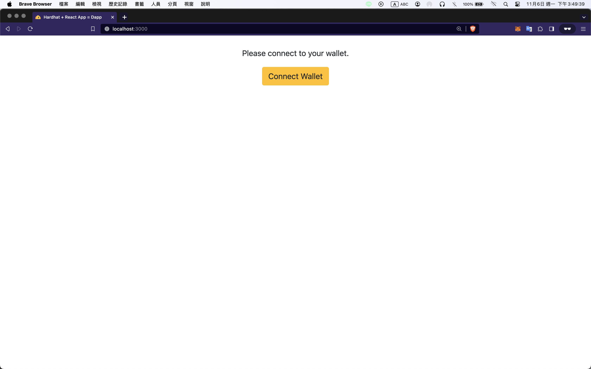
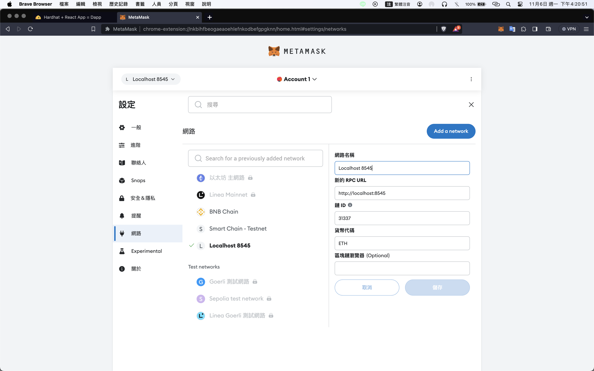
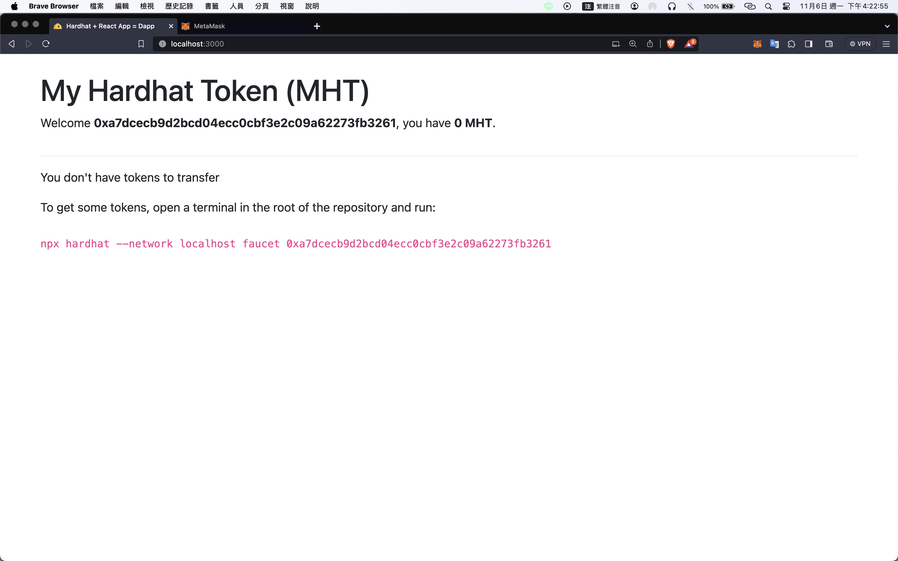
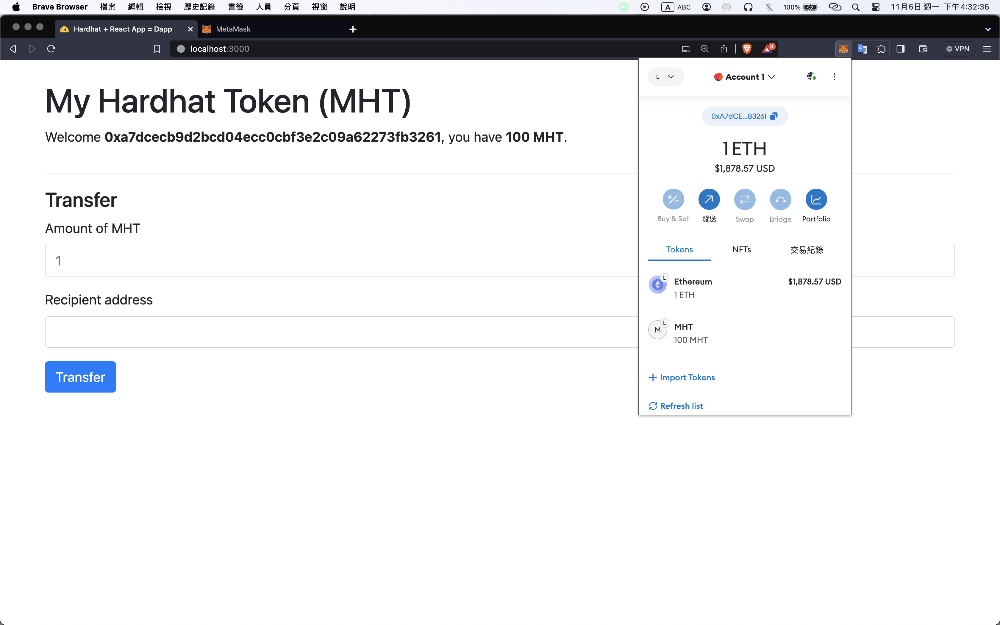
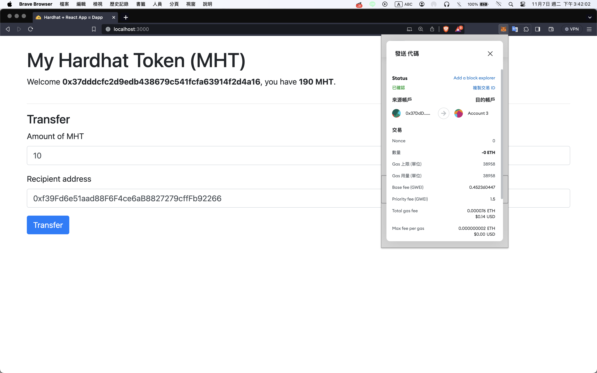

# Implementation hardhat-boilerplate

1.  進入 hardhat-boilerplate 並安裝

    ```
    cd hardhat-boilerplate
    npm install
    ```

2.  啟動 local network

    ```
    npx hardhat node
    ```

3.  部署合約到已啟動的 local network

    ```
    npx hardhat --network localhost run scripts/deploy.js
    ```

    `scripts/deploy.js`

    - Line 17: 命名第一個 signer 為 deployer

    - Line 25: getContractFactory 去讀取 contracts 底下 "Token" 合約

    - Line 26: 取得合約名稱 Token 的 factory 對象後，這個對象使用 deploy 方法(可傳入初始化合約參數)產生部署對象

    - Line 27: Token 部署對象使用 deployed 進行部署

    - Line 35: saveFrontendFiles 用來產生合約地址和 ABI 檔案

4.  進 frontend 並安裝，啟動前端介面

    ```
    cd frontend
    npm install
    npm run start
    ```

5.  打開 http://127.0.0.1:3000/
    

6.  設定 localhost:8545 network
    

7.  連接錢包
    

    `Dapp.js`

    - Line 174: 打開 MetaMask 授權 Acounts 畫面

    - Line 179: 檢查對應網路

    - Line 183: 初始化錢包資訊

    - Line 186: 監聽 accounte 改變，重新初始化錢包資訊

8.  輸入指令領取測試幣

    ```
    npx hardhat --network localhost faucet 0xa7dcecb9d2bcd04ecc0cbf3e2c09a62273fb3261
    ```

    

9.  轉帳成功
    

## Configiguration

`hardhat.config.js`

```
module.exports = {
    defaultNetwork: "sepolia",
    networks: {
        hardhat: {
        },
        sepolia: {
        url: "https://sepolia.infura.io/v3/<key>",
        accounts: [privateKey1, privateKey2, ...]
        }
    },
    solidity: {
        version: "0.8.19",
        settings: {
        optimizer: {
            enabled: true,
            runs: 200
        }
        }
    },
    paths: {
        sources: "./contracts",
        tests: "./test",
        cache: "./cache",
        artifacts: "./artifacts"
    },
    mocha: {
        timeout: 40000
    }
}
```

- `defaultNetwork`：預設啟動網路(預設網路為 hardhat)

- `networks`：自定義網路配置

  - `hardhat`：
    - [chainId](https://hardhat.org/hardhat-network/docs/reference#chainid)：預設 31337
    - [from](https://hardhat.org/hardhat-network/docs/reference#from)：轉帳帳戶，預設第一帳戶
    - [gas](https://hardhat.org/hardhat-network/docs/reference#gas)：
      - `auto`：自動估算氣體上限
      - `number`：限制每筆 Tx gas 上限
    - [gasPrice](https://hardhat.org/hardhat-network/docs/reference#gasprice)：類似 gas
    - [gasMutiplier](https://hardhat.org/hardhat-network/docs/reference#gasmultiplier)：估計 gas 與該數值相乘，給予 gas 一些空間。預設為 1
    - [accounts](https://hardhat.org/hardhat-network/docs/reference#accounts)：
      - `mnemonic`：註記詞
      -
