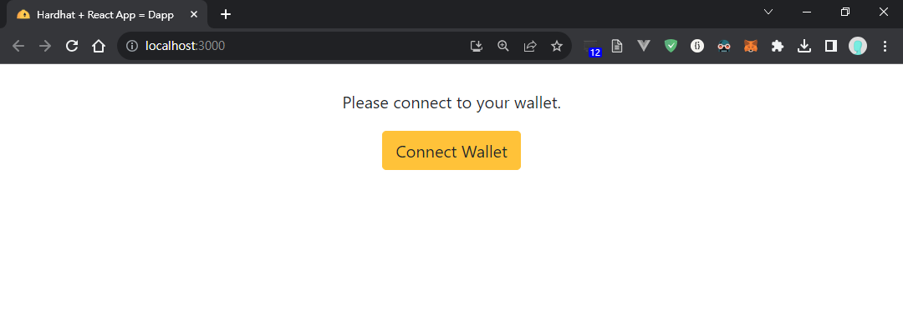
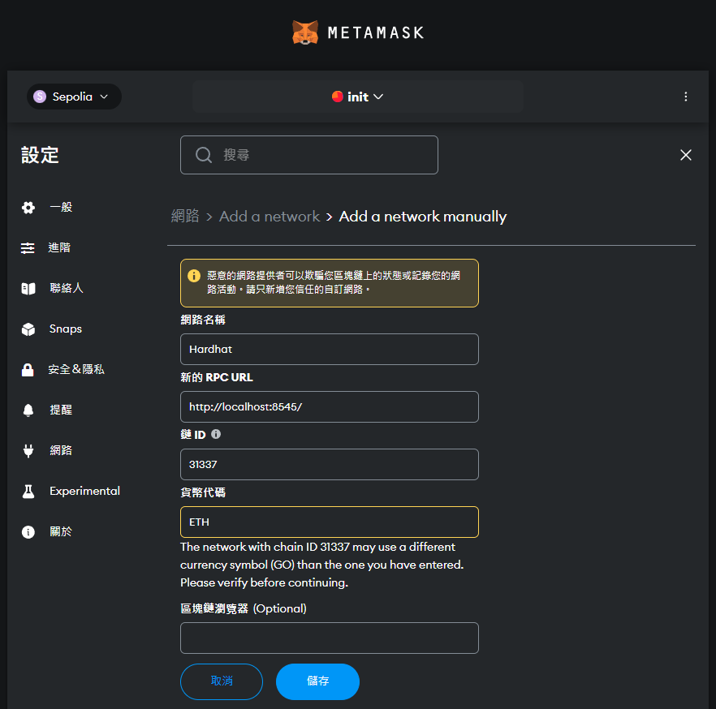
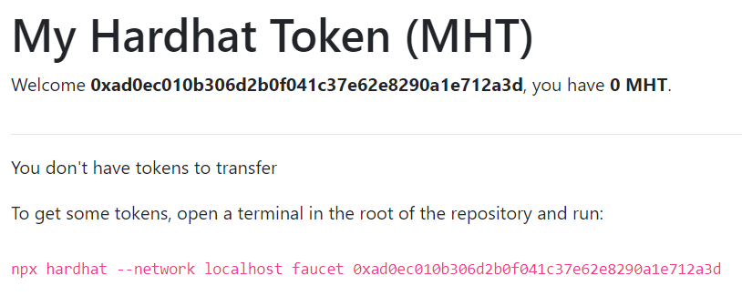
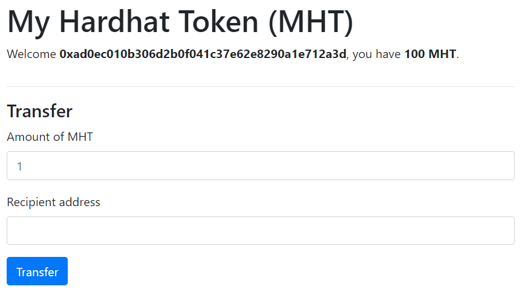
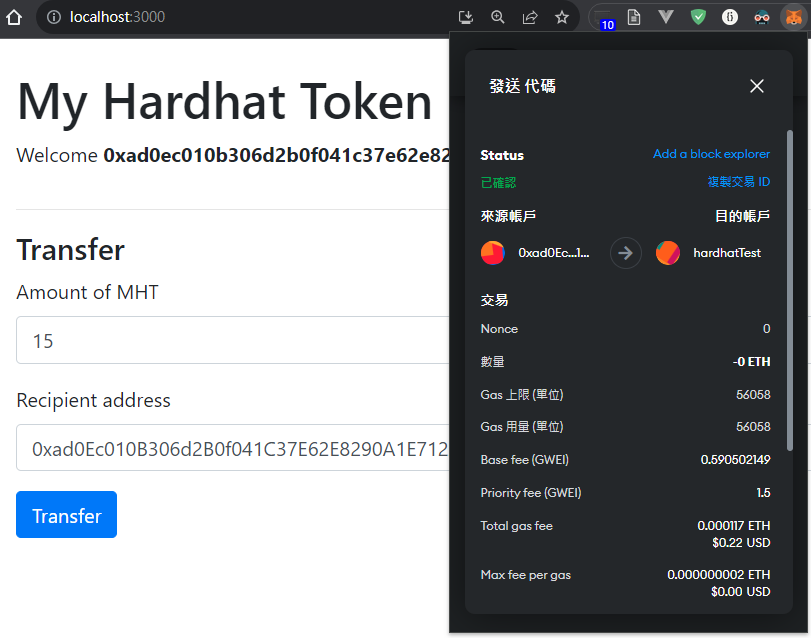

# hardhat-boilerplate
- 實作過程 REPO: https://github.com/rChinnnn/hardhat-tutorial

## 實作過程與截圖
1. 於 hardhat-tutorial 根目錄內 clone hardhat-boilerplate
```
git clone https://github.com/NomicFoundation/hardhat-boilerplate.git
cd hardhat-boilerplate
npm install
```
2. 運行 Hardhat 測試網路
```
npx hardhat node
```
3. 開一個新的 terminal 下部署合約指令
```
npx hardhat run scripts/deploy.js --network localhost
```
4. 執行前端 Dapp
```
cd frontend
npm install
npm start
```
5. 前往 http://localhost:3000/

6. Metamask add a network: Hardhat localhost:8545

7. 連接錢包後狀態

8. 輸入指令拿測試幣
```
npx hardhat --network localhost faucet 0xad0ec010b306d2b0f041c37e62e8290a1e712a3d
```
9. 確認錢包狀態

10. 轉帳給 hardhadTest 帳戶成功

