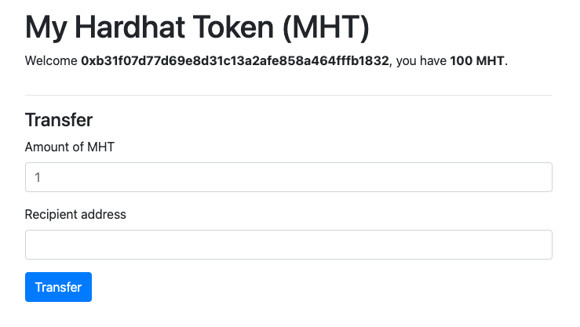

先使用下面指令把 Hardhat Boilerplate 複製到自己的 repository 並且把 dependencies 安裝起來：

```sh
git clone https://github.com/NomicFoundation/hardhat-boilerplate.git
cd hardhat-boilerplate
npm install
```

完成後執行 Hardhat 的測試網路：

```sh
npx hardhat node
```

執行後會在終端機看到下面的狀態，表示測試網啟動成功。


開啟新的終端機，執行下面指令來部署合約：

```sh
npx hardhat run scripts/deploy.js --network localhost
```

最後執行下面的指令，開啟前端專案：

```sh
cd frontend
npm install
npm start
```

啟動後，應該會看到下面的頁面：


點擊按鈕並且連接錢包後，會看到下面內容：


這表示前端的 code 偵測到裡面沒有 token，對應的程式碼如下：

```javascript
{
  this.state.balance.eq(0) && (
    <NoTokensMessage selectedAddress={this.state.selectedAddress} />
  );
}
```

需要透過執行下面的指令，空投 token 到帳戶裡：

```sh
npx hardhat --network localhost faucet <your address>
```
上面的指令會執行 hardhat 的 task ，而該 task 內容，是將 100 MHT 跟 1 ETH 傳到指令的地址。

指令執行完畢後畫面會跳轉成如下：



透過 UI 畫面操作傳送 MHT 後，錢包會跳出：


傳送完成後，可以看到 MHT 改變了，表示傳送成功。


