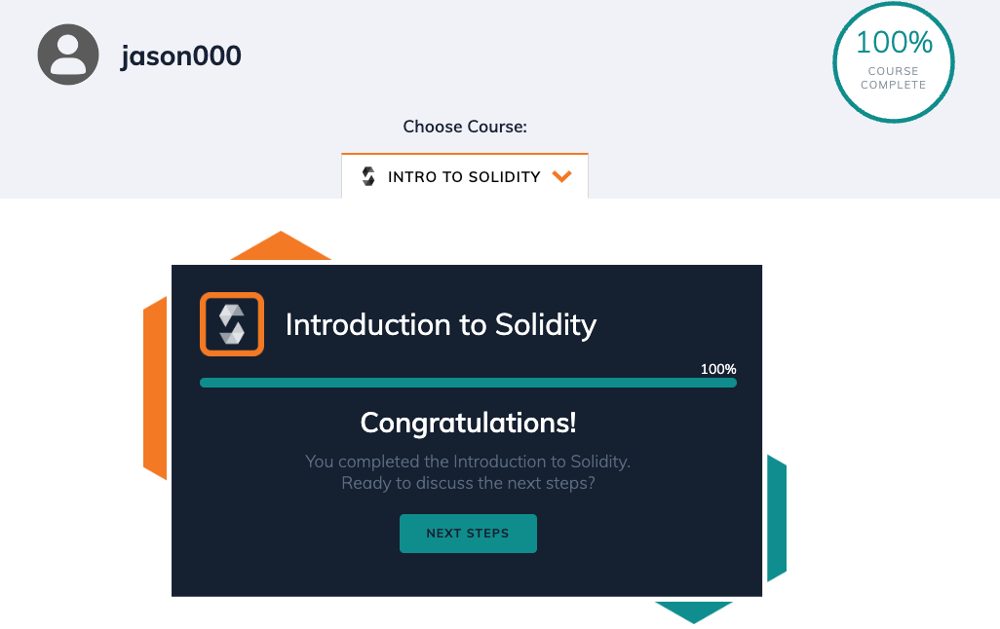

# Online tutorial

- [學習筆記](../reading_and_summary/README.md)
- [chainshot](https://www.chainshot.com/learn/solidity)

  

- [cryptozombies](https://cryptozombies.io/en/course)

  
  

# 加分題： My Token Mint NFT Project

## 專案目標

- 自定一個符合 ERC20 的 token，並以該 token 去鑄造 NFT

## 介紹

- **ERC20**：是一種用於擴展與更廣泛的以太坊網路相關的可交換代幣的技術，現已在加密生態系統中可用，流程通常需要支付兩次燃氣費：一次是授權( approve )代幣，一次是實際購買時的代幣轉移( transferFrom ) ，例如：**交易平台購買商品**
  - [transfer](https://eips.ethereum.org/EIPS/eip-20#transfer)：轉 token 給其他用戶，不需要 approve
  - [approve](https://eips.ethereum.org/EIPS/eip-20#approve) ：函數的主要作用是授權給第三方，讓他交易一定數量的金額，例如 : [[ERC721]]
  - [allowance](https://eips.ethereum.org/EIPS/eip-20#allowance)：可以看出第三方代可以從指定錢包拿出多少錢，要先使用 approve 後才會有值
  - [transferFrom](https://eips.ethereum.org/EIPS/eip-20#transferfrom)：token 的持有者想要允許另一個地址（第三方代為執行，例如：用戶允許一個 NFT 市場合約）轉移一定數量的 token
- **ERC721** : 這是不可替代令牌（ NFT ）的令牌標準。每個代幣都是獨一無二的，都有自己的代碼，這導致了加密收藏品的蓬勃發展，包括交易卡和數字藝術品
- 為了達成該 NFT 智能合約( `MyNFT.sol` )可以用我自訂的 token 建立 NFT，必須在合約中存取該自訂 token 合約地址( `MyNFT.sol` )， 以達成自訂 token 合約( `MyNFT.sol` )授權( `approve` )後的交易

## 流程

1. 部署 `ＭyToken.sol` (用於建立我自己用來交易的 token) 和 `MyNFT.sol` (建立 NFT)

   
  

2. 在 `MyNFT.sol` approve 欲購買 NFT 的帳號地址（可以使用 `MyToken.sol` 的 `allowance` 確認是否有成功授權 ）

  

3. 使用 `MyNFT.sol` 去執行 `safeMint` 來鑄造 NFT

 

4. 最後 `MyNFT.sol` 可以執行 `withdrawToken` 讓部署合約的人取出錢（例子中因為部署兩個合約和購買是同一個人，所以在取出 token 後，又變回 1000 token）

