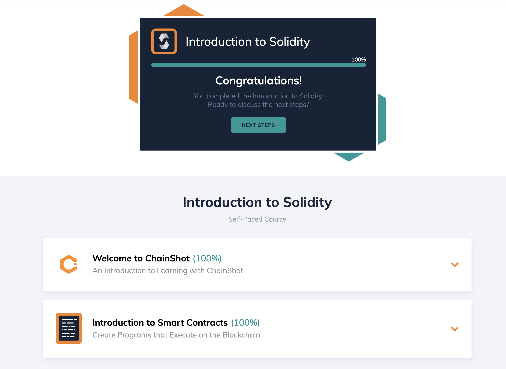
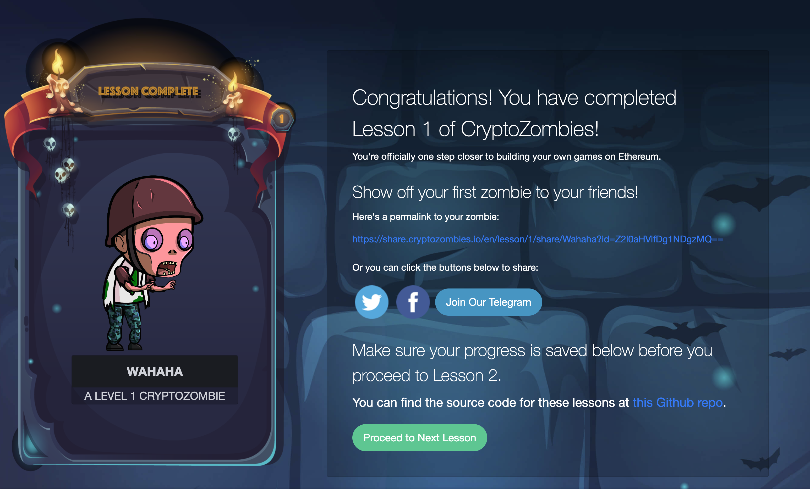
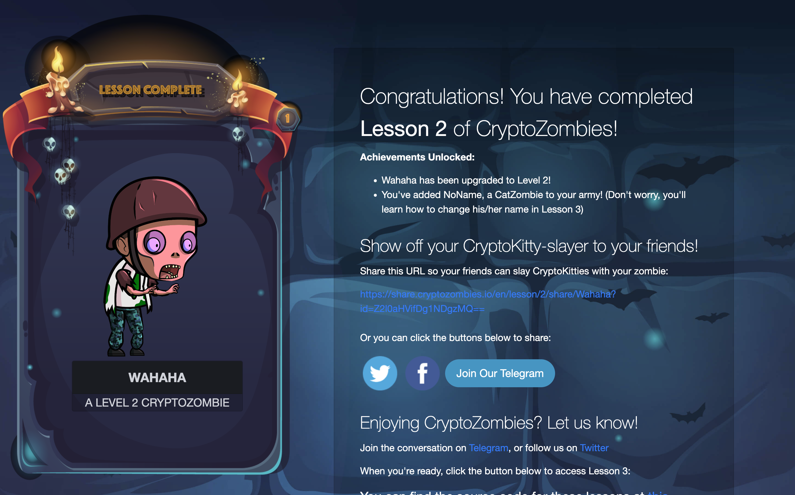

# W3 課程與作業 - 智能合約基礎
W3 作業

## ChainShot

## Crypto Zombies

- Version Pragma: 設定智能合約可以編譯的版本，以防跑了不相容的版本。
- uint 跟 int: unsigned integer 跟 integer，分別都可以設定說使用多少空間，從 8 位元到 256 位元都可以用。
- struct: 自定義的結構去打包多個資料函數。
- array: 有固定長度跟動態長度
- mapping: key-value pairs，類似 hash table。
- address: 可以是錢包地址，也可以是合約地址。
- msg: 包含 sender 跟 value ，呼叫這個智能合約的地址跟從傳近來的 ether 。還有其他資料向 data, gas, sig 。
- function 種類有分 private, internal, external, public
  - private: 只能由這個智能合約內部呼叫
  - internal: 只能從內部呼叫或是繼承這個合約的子合約
  - external: 只能從外部呼叫
  - public: 可以從內部也可以從外部呼叫
- view function 是不會更改 state 。
- pure function 是不會該改也不會讀取 state 。
- 只有 payable function 跟 address 可以收 ether 。
- event: 因為智能合約的執行時間與完成時間都不可控，event 可以方便我們去更新區塊鏈外部說某件事情完成了，可以靠這個去寫 callback function 。
- storage & memory: storage 是會存在鏈上的資料，memory 只局限於 function 跑的時候會使用， function 結束即被捨去。另外還有一個 calldata 是傳給 function 的參數會使用。
- keccak256 - 有時候會用到的 SHA3 hash function 。
- require - 常拿來定義執行 function 的條件，像是：檢查是不是由智能合約擁有者執行，不是的話就回傳錯誤。
- function 可以以 tuple 的形式回傳多個數值。
- contract 有像 OOP class 一樣繼承的概念。
- solidity 也有 interface 的概念去串接其他智能合約，不需要知道實際的內容，只需要 function signature 。 串接時只要提供智能合約地址便可以成功串接。
