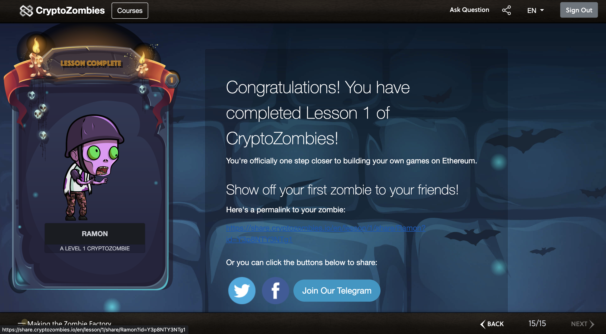
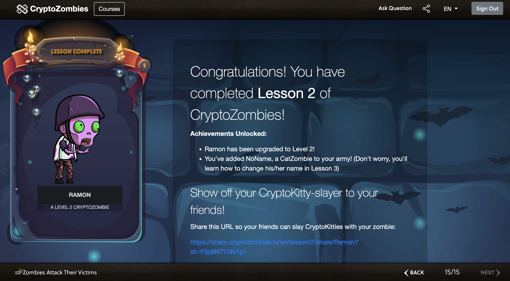

# Solidity Learning Path

## 1. Chainshot

### Completion Certificate

Register an account at the link below, complete all Lessons and provide screenshots.

https://www.chainshot.com/learn/solidity

## 2. Crypto Zombies

Register an account at the link below and complete Lesson 1 Making the Zombie Factory & Lesson2 Zombies Attack Their Victims.

https://cryptozombies.io/en/course

Summary Learn knowledge points from Lesson 1 & Lesson 2, such as what are the types of functions, what is the purpose of event, the difference between variable access in storage & memory, the difference between Internal & External functions, etc.

### Completion Repository ([Link](https://github.com/RamonLiao/CryptoZombies))

## 3. OpenZeppelin Contracts Test

Git clone [openzepplin-contracts](https://github.com/OpenZeppelin/openzeppelin-contracts/), and follow the usage of Hardhat framework introduced in the last class, run the smart contract test (npx hardhat test) inside, observe what smart contracts are inside, and how to write the test
