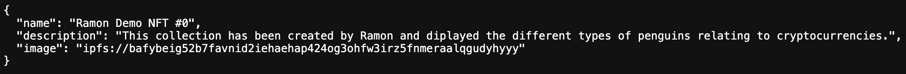
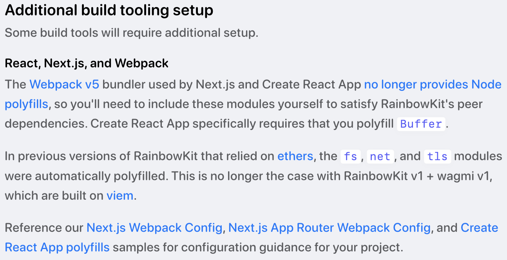

# Creating a ERC721 contract and showing NFT imges on a dAPP

Building the first dApp by using wagami and walletConnect modules. By connecting to web3 wallet, the dapp can show the owner's own NFT images.

## A NFT Contract Development and NFT Creationn

Mint NFT - tokenURI has to be the location of a JSON blob of data with the metadata ([metadata standard](https://docs.opensea.io/docs/metadata-standards)) for ERC721 token. Essential properties are such as `name`, `description`, `image` to allow NFT marketplace, like [OpenSea], to retrieve the information of your NFT.

NFT on OpenSea: [RamonDemoNFT](https://testnets.opensea.io/collection/ramondemonft)

Contract Address: [0xA6cdC55F3B373ff916E0493f2E3491753EF98297](https://sepolia.etherscan.io/address/0xa6cdc55f3b373ff916e0493f2e3491753ef98297)

References:

1. [How to Create and Deploy an ERC-721 (NFT)]
2. [NFT.STORAGE Quickstart]
3. [IPFS Gateways]

## A DApp Development

The location of NFT Image on IPFS ([link](https://ipfs.io/ipfs/bafkreid3dpobfzozvgtuem4z7bsboz2n3dfb2t6leaq6rceggrqa5zq4u4))



## Debugging and solutions

1. Additional configurations for Next.js due to unsupported Node polyfills from the Webpack v5

   > The Webpack v5 bundler used by Next.js and Create React App no longer provides Node polyfills, so you'll need to include these modules yourself to satisfy RainbowKit's peer dependencies. Create React App specifically requires that you polyfill Buffer.
   > https://www.rainbowkit.com/docs/installation#configure

   

   **Solution:** additional configurations in `next.config.js` ([link](https://github.com/rainbow-me/rainbowkit/blob/main/examples/with-next-app/next.config.js))

   ```JavaScript
   /** @type {import('next').NextConfig} */
   const nextConfig = {
     reactStrictMode: true,
     webpack: config => {
       config.resolve.fallback = { fs: false, net: false, tls: false };
       config.externals.push('pino-pretty', 'lokijs', 'encoding');
       return config;
     },
   };

   module.exports = nextConfig;
   ```

2. Building Error
   When using modules imported from `@rainbow-me/rainbowkit` in a component, it is necessary to configured as client-side rendering. If it is with default configuration (server-side rendering), Next.js will throw an error message such as the one shown below.

   ```console
   ⨯ ./node_modules/wagmi/dist/chains.js
   Error: It's currently unsupported to use "export *" in a client boundary. Please use named exports instead.
   Import trace for requested module:
   ```

   **Solution:** Add `"use client";` at the top of `providers.tsx` component.

3. Environment Variables
   Some credential keys for configurations are inappropriately accessible to the public because of security issues. Therefore, credential keys for setting wallet connections within an app will be replaced with environment variables. This can prevent the keys be accessed explicitly. However, under Next.js framework, environment variables are only available in the Node.js environment (servier side) rather then in the browser (browsers are client side and running in a different environment).

   **Solution:** ([link](https://nextjs.org/docs/app/building-your-application/configuring/environment-variables))

   3.1. Prefixing the environment variables with `NEXT_PUBLIC_` in `.env*` files. This method would allow environment variables be bunddled during running `next build`. However, all `NEXT_PUBLIC_` will be frozen with the value evaluated at build time, it is no longer available to be changed during deployment pipeline.

   3.2. Setting up own **API endpoints** to provide runtime environment values to the client (either on demand or during initialization).

   3.3. By using `getServerSideProps` function or App Router, it is able to read runtime environment variables on the server during dynamic rendering.

   3.4. Setting configurations in `next.config.js` as the codes shown below. Then, the environment variables will be accessible to the client-side rendering component. (This solution is mainly used for versions of Next.js prior to 9.4.) ([link](https://levelup.gitconnected.com/next-js-environment-variables-are-undefined-lets-solve-the-problem-9c4e8ee4a689))

   In `next.config.js`:

   ```JavaScript
   module.exports = {
    reactStrictMode: true,
    env: {
      API_KEY: process.env.BASE_URL,
    }
   }
   ```

   In a client-side rendering component:

   ```JavaScript
   "use client";
   ...
   const API_KEY = process.env.API_KEY;
   ...
   ```

## References

1. [Create Next](https://nextjs.org/docs/pages/api-reference/create-next-app)
2. [Rainbow kit](https://www.rainbowkit.com/)
3. [Wagmi](https://wagmi.sh/)
4. [MetaMask SDK](https://metamask.io/sdk/)
5. [ehter.js (v5)](https://docs.ethers.org/v5/)

[OpenSea]: (https://testnets.opensea.io/) "OpenSea - NFT Marketplace"
[How to Create and Deploy an ERC-721 (NFT)]: (https://www.quicknode.com/guides/ethereum-development/nfts/how-to-create-and-deploy-an-erc-721-nft) "Create and Deploy ERC-721"
[NFT.STORAGE Quickstart]: (https://nft.storage/docs/quickstart/) "Quickstart for storing NFT"
[IPFS Gateways]: (https://docs.pinata.cloud/docs/ipfs-gateways) "IPFS Gateways"
