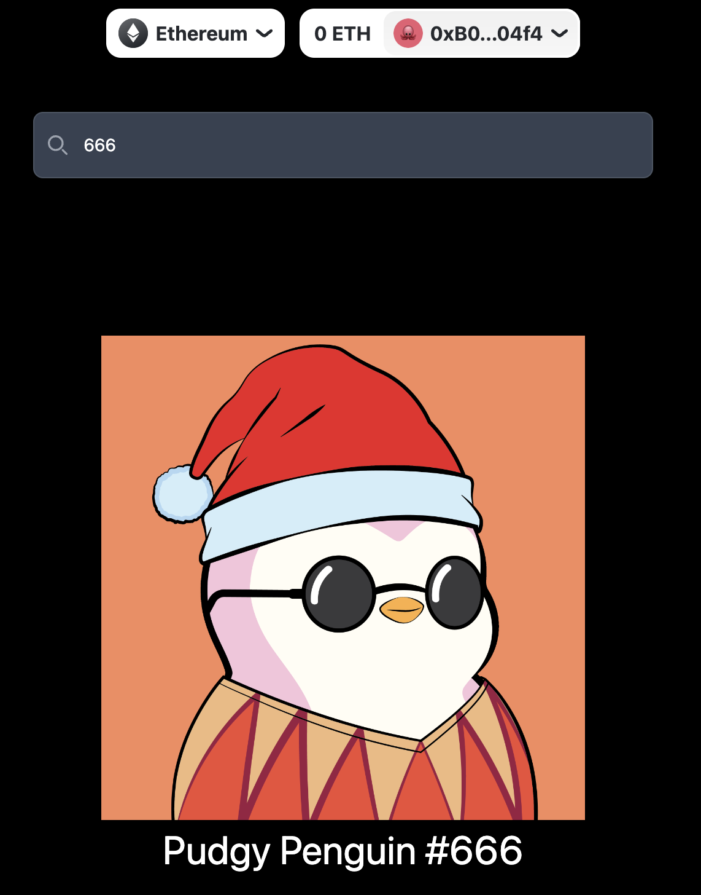
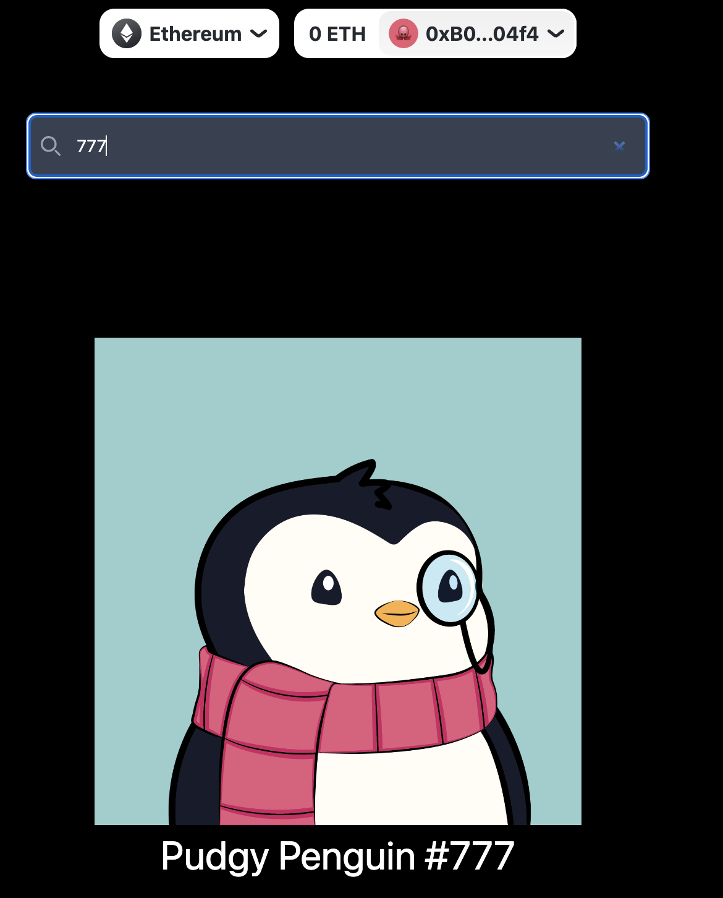

# 專案介紹

- 在輸入框輸入 tokenID，下面圖片會有相對應的 NFT 圖片顯示

| | | |
|:-------------------------:|:-------------------------:|:-------------------------:|
||||

# 練習

- 練習使用 wagmi hook 來呼叫合約提供的 function

# 問題
- 因為 next.js SSR 的關係，在使用 wagmi hook 時，常發生 `hydrating server and client data not match` 的錯誤，對於 next.js 沒有很熟悉，暫時是以 useEffect 的方式處理錯誤