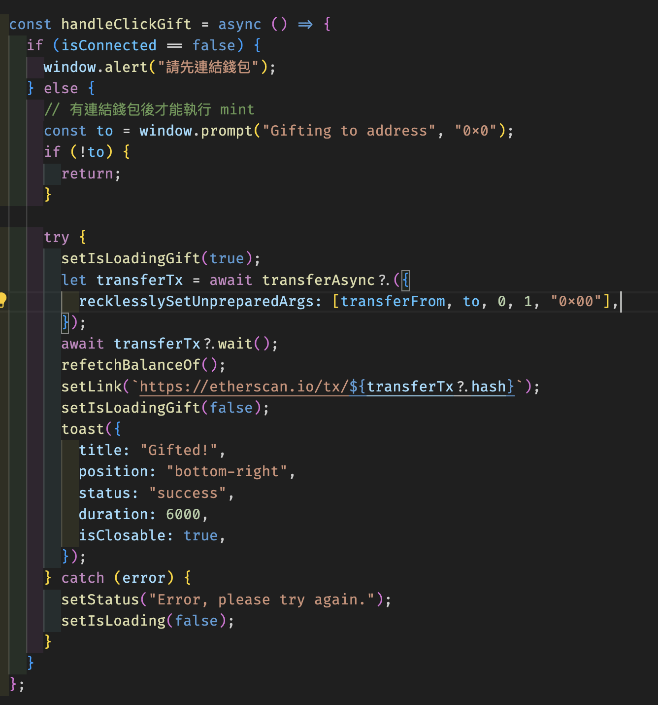

# W5 作業 - 前端 DApp 串接

## SBF Bonk

- SBF Bonk forked repo: <https://github.com/jtsaich/SBF-BONK/tree/main>
- Demo (Goerli): <https://sbf-bonk.vercel.app/en>
- Contract address: <https://goerli.etherscan.io/address/0x70ab157d214dFf92E1f3f6DE8d395D66f17FF104>

### 專案架構

專案是用 hardhat 跟 next.js 作為框架，合約為上限 1111 的 ERC1155 token。前端資料在 index.tsx 裡呼叫合約拿到資料再傳給子模組，在 `hooks` 包了 wagmi 的 hook 去讀取跟寫入合約。

### 困難

- 在 Etherscan 上目前還是沒辦法顯示 NFT 的圖片

### 新功能

- 增加了看到現在擁有幾個 CyberBonk NFT 的介面
- 增加了轉移 CyberBonk NFT 的功能

### 截圖

## Namecard

- repo: https://github.com/jtsaich/web3-namecard/tree/main

## 專案架構

專案使用了 next.js 加上 rainbowkit，建立了 custom hook 去對接 ENS 智能合約與呼叫 OpenSea API。

### 新功能

- 新增可以觀看下 5 個錢包地址的 NFT
- 用新的 OpenSea API

### 截圖

