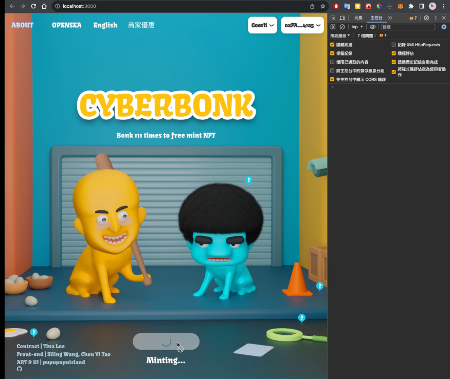
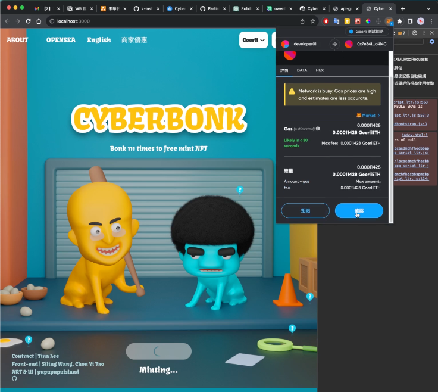
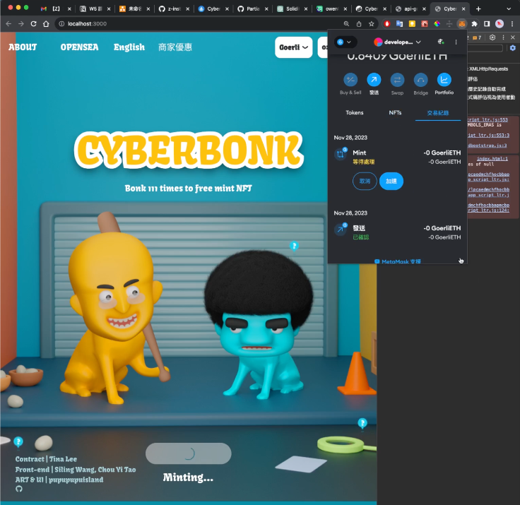
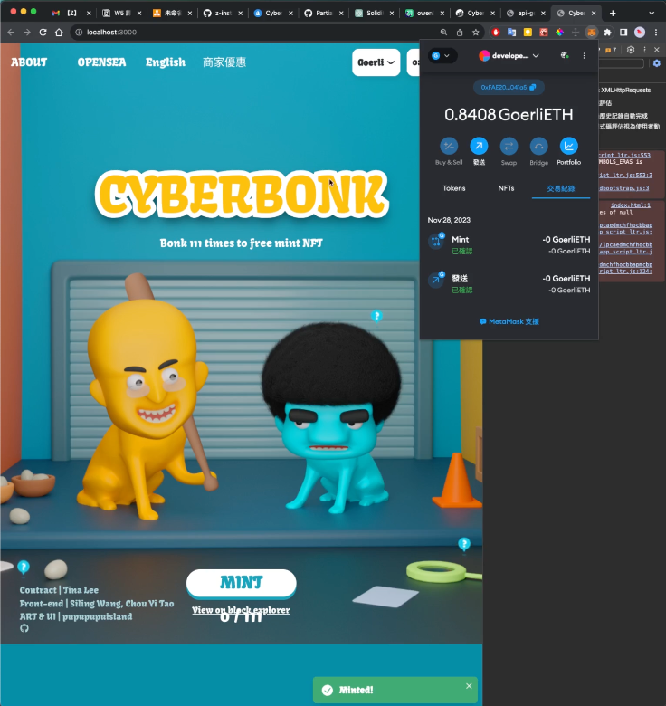
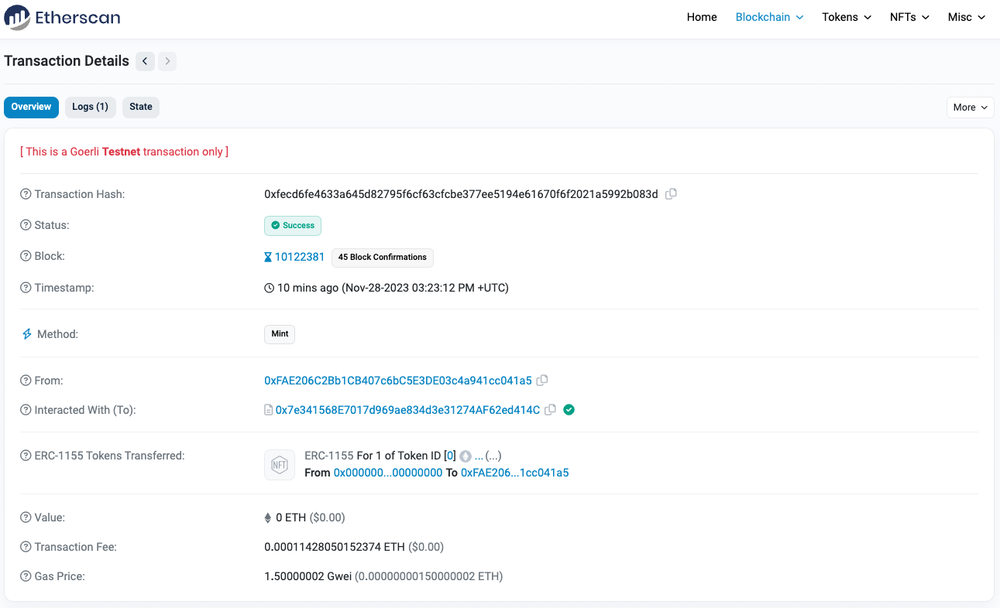
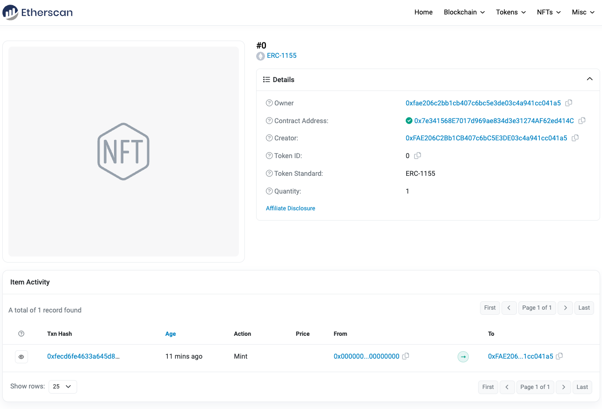

# W5

## SBF-BONK

## 專案開啟步驟

1. git clone SBF-BONK 的專案
2. install dependencies use:
```bash
npm install
```
3. add .env file
```env
ALCHEMY_API_KEY=[replace with your alchemy API key]
PRIVATEKEY=[add your private key]
ETHERSCAN_API_KEY=[add yourETHERSCAN API key]
```
4. deploy contracts to goerli test net use:
```bash
npx hardhat run scripts/deploy.js --network goerli
npx hardhat verify [replace with your contract address] --network goerli ""
```
5. the screenshot of the minting process is as follows







## issue 
圖片無法正常顯示出來，正在研究中
