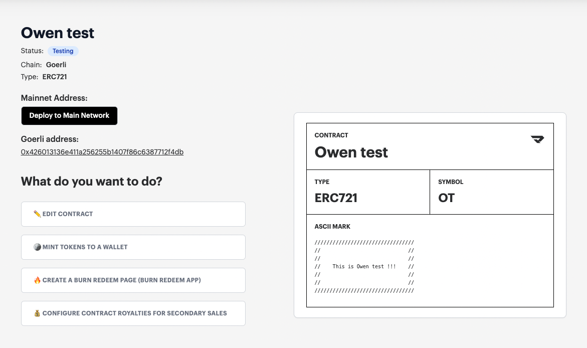
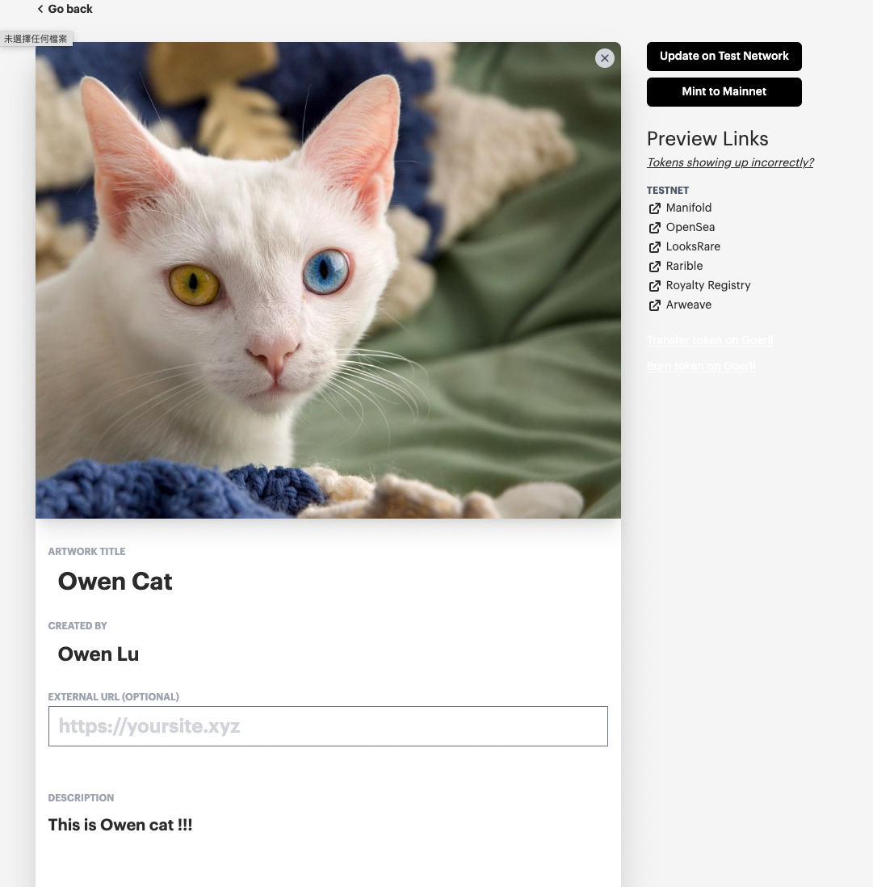
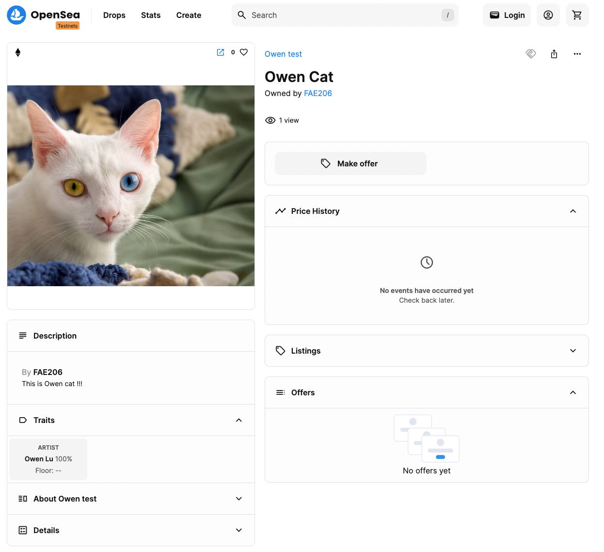
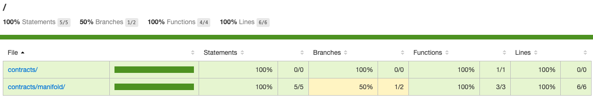

# W6

##  Manifold 過程截圖

## 合約測試

## Manifold 使用過程
- 點擊 new contract 就進入合約創建頁面，可以決定自己的合約名稱、符號以及要使用的協議類型。
- 選擇要使用的協議類型，目前平台提供兩種協議分別是 ERC721 、 ERC1155
- 再來可以在 ASCII MARK 寫些東西，後來發現可以在[這裡](https://patorjk.com/software/taag/#p=display&f=3D-ASCII&t=owen%20cat)弄一些字體變化，還蠻有趣的
- 選擇測試網並且點擊部署後，稍微等一下就完成了
- 部署後可以點擊 token ，再點擊 create 來 mint 新的 token
- mint 時有一些 properties 可以設定，可以根據需求來自行增加

## Manifold 使用心得

經過直接使用體驗過整套流程後，有感受到這平台設計得非常容易使用，而且在使用文件上的說明可以感受得出來，這平台蠻面向非技術背景的使用者，讓許多不同領域的創作者，都可以用無代碼的方式，出售自己的數位創作。

