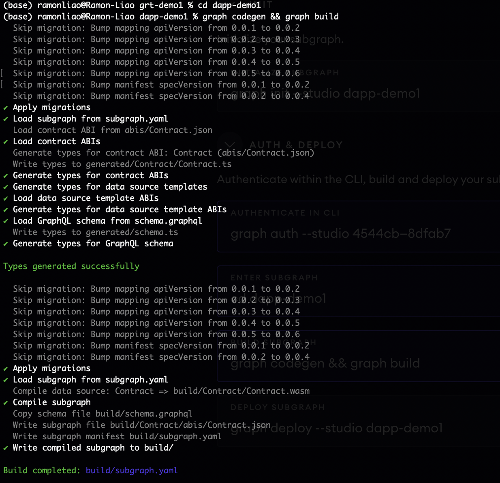

# Exercise: The Graph

## Introduction

The Graph: A Bridge Between Blockchain and Applications
The Graph is an indexing protocol, essentially acting as a bridge between complex blockchain data and applications that want to utilize it. Think of it as a giant, decentralized library for blockchain data, organized and readily accessible through GraphQL queries.

Here's the gist:

- Indexing: The Graph indexes data from blockchains like Ethereum, transforming raw data into easily understandable formats.
- Subgraphs: Developers define these formats through building blocks called "subgraphs," specifying which data to index and how to present it.
- GraphQL: Applications "talk" to The Graph using GraphQL, a query language that lets them request specific pieces of data they need.

Benefits:

- Faster Development: Skip building and maintaining your own data infrastructure, focusing on application logic instead.
- Cost-Effective: Lower costs compared to running dedicated servers or manually parsing raw data.
- Reliable: Globally distributed network ensures high uptime and data availability.
- Decentralized: No single entity controls the data, fostering transparency and trust.

Quick Start: https://thegraph.com/docs/en/quick-start/

## Exercise

Steps:

1. Create a subgraph on Subgraph Studio
   Go to the [Subgraph Studio](https://thegraph.com/studio/) and connect the wallet.

   Click "create a subgraph" and select the network of your choice and click continue.

2. Install the Graph CLI
   Open a terminal and execute these commands:

   - npm

   ```console
   npm install -g @graphprotocol/graph-cli
   ```

   - yarn

   ```console
   yarn global add @graphprotocol/graph-cli
   ```

3. Initialize your Subgraph
   Run the following command to initialise the subgraph.

   ```console
   graph init --studio <SUBGRAPH_SLUG>
   ```

   
   

   In this case, `<SUBGRAPH_SLUG>` is `dapp-demo1`. During the initialisation, the subgraph needs a contract address to fetch its reletive details such as ABI and events. Therefore, I used my previous NFT contract `0xA6cdC55F3B373ff916E0493f2E3491753EF98297` on Sepolia Testnet to complete the process.

4. Write your Subgraph
   In the folder `dapp-demo1`, three files are created. Developer will mainly work on these files.

   - Manifest (subgraph.yaml)
   - Schema (schema.graphql)
   - AssemblyScript Mappings (mapping.ts)

   Reference: https://thegraph.com/docs/en/quick-start/#4-write-your-subgraph

5. Deploy to the Subgraph Studio
   Firstly, authenticate within the CLI, build and deploy the subgraph to the Studio.

   ```console
   graph auth --studio <DEPLOY_KEY>
   ```

   `<DEPLOY_KEY>` can be copied from the page of your subgraph.

   

   Direct to the folder (subgraph) `dapp-demo1` and execute the command (build subgraph).

   ```console
   graph codegen && graph build
   ```

   

   Once subgraph is build, we can deploy it to Subgraph Studio (which is connected to our wallet.) The reletive files will be added to IPFS at the same time.

   ```console
   graph deploy --studio <SUBGRAPH_SLUG>
   ```

   

6. Test your subgraph

   In Subgraph Studio, you can look into logs and test GraphQL in `Playground` tab.

   

   In the playground, the graph provides visualised selections for easily writing GraphQL.
   
   

   All selective entities and fields are referred to the contract `0xA6cdC55F3B373ff916E0493f2E3491753EF98297` on Sepolia Testnet.

7. Publish Your Subgraph to The Graph’s Decentralized Network

   Prepare `GRT` tokens and ethers for publish your subgraph on the layer2.

8. Query your Subgraph

   Once your subgraph is deployed, the process will display your query endpoint in terminal

   ```console
   Queries (HTTP):     https://api.studio.thegraph.com/query/61929/dapp-demo1/v0.0.1
   ```
