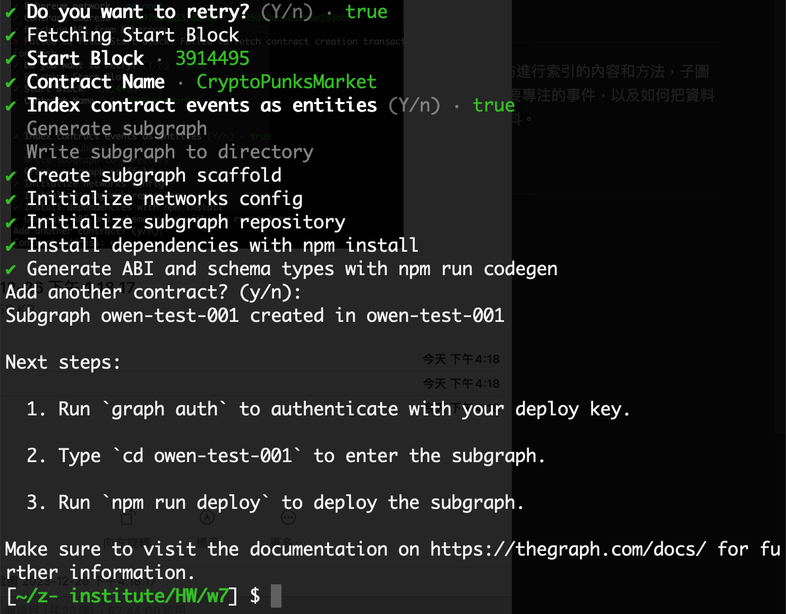

# Graph 簡介

是一個去中心化的協議，用來解決區塊鏈數據難以被索引的問題。

因為區塊鏈的特性，為鏈上數據編制索引非常困難，以往要解決這問題，可能會需要建立一個自己的伺服器，比較費工的同時，也破壞了去中化化的屬性。

透過這工具，即可為自己的項目，建立一個可供他人使用的索引工具。

# 工作原理
基於 子圖描述（subgraph）學習對以太坊進行索引的內容和方法，子圖描述定義子圖感興趣的智能合約、合約中要專注的事件，以及如何把資料映射到 the graph 要儲存在資料庫中的資料。

# 過程截圖

# 簡易說明

[官方文件](https://thegraph.com/docs/zh/quick-start/)寫得很完整，基本上照著做就好，下面補充一些我覺得比較方便的步驟。

1. 到 [Subgraph Studio](https://thegraph.com/studio/) 創建完自己的 subgraph 後，可以在右下找到官方提供的指令，照著上面的順序複製貼上到終端機即可。

2. 比較麻煩的是初始化 subgraph 時，有一些參數要提供，這邊一樣照著官方的說明進行：

- 協議（Protocol）：選擇您的子圖要從中索引數據的協議
- 子圖別名（Subgraph slug）：為您的子圖創建一個名稱。您的子圖別名是對您的子圖的標識符。
- 創建子圖的目錄（Directory to create the subgraph in）：選擇您的本地目錄
- 以太坊網絡（可選）：您可能需要指定您的子圖將從哪個兼容以太坊虛擬機（EVM-compatible network）索引數據
- 合約地址（Contract address）：找到您想查詢數據的智能合約地址
- ABI：如果ABI未自動填充，您需要手動輸入它，以JSON文件的形式
- 開始塊（Start Block）：建議輸入開始塊以節省時間，同時使您的子圖索引區塊鏈數據。您可以通過找到部署您的合約的區塊來定位起始塊。
- 合約名稱（Contract Name）：輸入您的合約名稱
- 事件索引為實體（Index contract events as entities）：建議設置為true，因為它將自動為每個發出的事件向您的子圖添加映射
- 添加另一個合約（可選）：您可以添加另一個合約

3. 上面的過程完成後，即可在自己的 [Subgraph Studio](https://thegraph.com/studio/)看到部署完的狀態。

4. 這 [影片](https://www.youtube.com/watch?v=EJ2em_QkQWU) 有示範創建 subgraph 的過程，可以參考。
